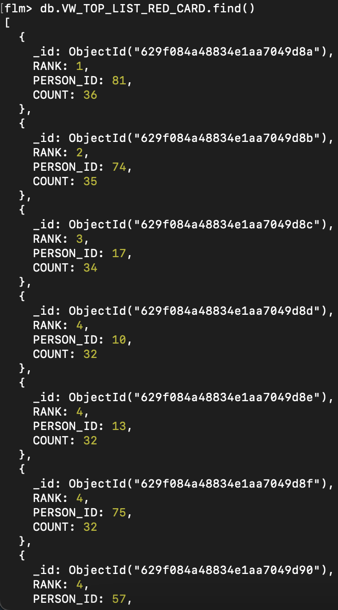
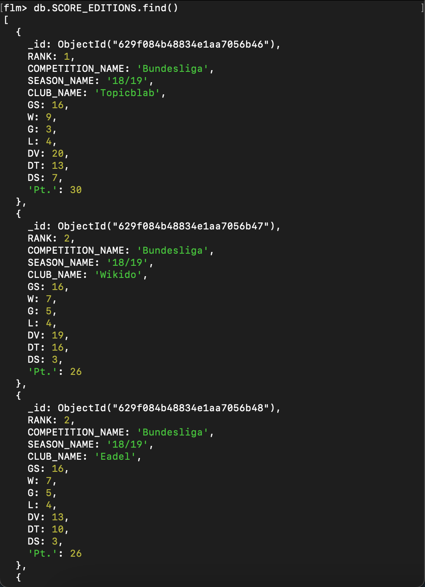
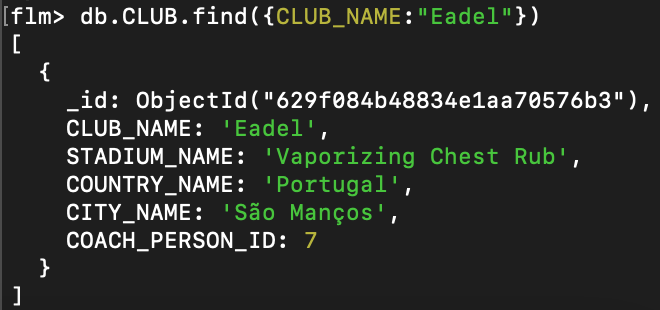
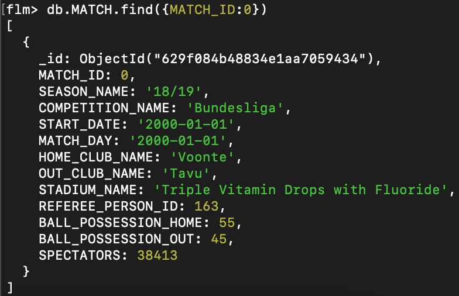
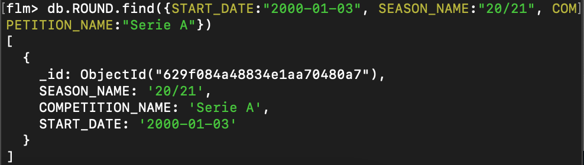
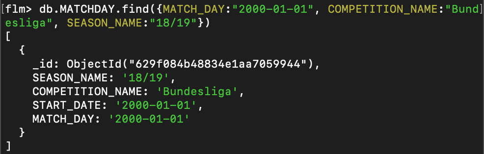

# End-to-End testing

## Use cases

### Ophalen top-lijst

| Stap | Actie                                                      | Input                                                                       | Output                                                                      |
|------|------------------------------------------------------------|-----------------------------------------------------------------------------|-----------------------------------------------------------------------------|
| 1    | Maak verbinding met de database                            | mongosh 127.0.0.1:27017/flm -u mongo -p toor --authenticationDatabase admin |         |
| 2    | Voer query uit voor het ophalen van top-lijst rode kaarten | db.VW_TOP_LIST_RED_CARD.find()                                              |  |

### Ophalen tussenstand competitie

| Stap | Actie                                                      | Input                                                                       | Output                                                                                   |
|------|------------------------------------------------------------|-----------------------------------------------------------------------------|------------------------------------------------------------------------------------------|
| 1    | Maak verbinding met de database                            | mongosh 127.0.0.1:27017/flm -u mongo -p toor --authenticationDatabase admin |                      |
| 2    | Voer query uit voor het ophalen van tussenstand competitie | db.SCORE_EDITIONS.find()                                                    |  |

### Ophalen clubinfo

| Stap | Actie                                                          | Input                                                                       | Output                                                                     |
|------|----------------------------------------------------------------|-----------------------------------------------------------------------------|----------------------------------------------------------------------------|
| 1    | Maak verbinding met de database                                | mongosh 127.0.0.1:27017/flm -u mongo -p toor --authenticationDatabase admin |        |
| 2    | Voer query uit voor het ophalen van club informatie over Eadel | db.CLUB.find({CLUB_NAME:"EADEL"})                                           |  |

### Ophalen matchinfo

| Stap | Actie                                              | Input                                                                       | Output                                                                      |
|------|----------------------------------------------------|-----------------------------------------------------------------------------|-----------------------------------------------------------------------------|
| 1    | Maak verbinding met de database                    | mongosh 127.0.0.1:27017/flm -u mongo -p toor --authenticationDatabase admin |         |
| 2    | Voer query uit voor het ophalen van match met ID 0 | db.MATCH.find({MATCH_ID:0})                                                 |  |

### Ophalen speelronde info

| Stap | Actie                                                                                                         | Input                                                                                     | Output                                                                           |
|------|---------------------------------------------------------------------------------------------------------------|-------------------------------------------------------------------------------------------|----------------------------------------------------------------------------------|
| 1    | Maak verbinding met de database                                                                               | mongosh 127.0.0.1:27017/flm -u mongo -p toor --authenticationDatabase admin               |              |
| 2    | Voer query uit voor het ophalen van speelronde met startdatum 03-01-2000, seizoen 20/21 en competitie Serie A | db.ROUND.find({START_DATE:"2000-01-03", SEASON_NAME:"20/21", COMPETITION_NAME:"Serie A”}) |  |

### Ophalen matchday info

| Stap | Actie                                                                                              | Input                                                                                          | Output                                                                         |
|------|----------------------------------------------------------------------------------------------------|------------------------------------------------------------------------------------------------|--------------------------------------------------------------------------------|
| 1    | Maak verbinding met de database                                                                    | mongosh 127.0.0.1:27017/flm -u mongo -p toor --authenticationDatabase admin                    |            |
| 2    | Voer query uit voor het ophalen van matchday 01-01-2000 in seizoen 18/19 uit competitie Bundesliga | db.MATCHDAY.find({MATCH_DAY:"2000-01-01", COMPETITION_NAME:"Bundesliga", SEASON_NAME:"18/19"}) |  |

### Invoeren matchdata

### Updaten clubinfo

### Start nieuw seizoen competitie

### Toevoegen nieuw persoon

### Toevoegen nieuw event type

### Overzetten data