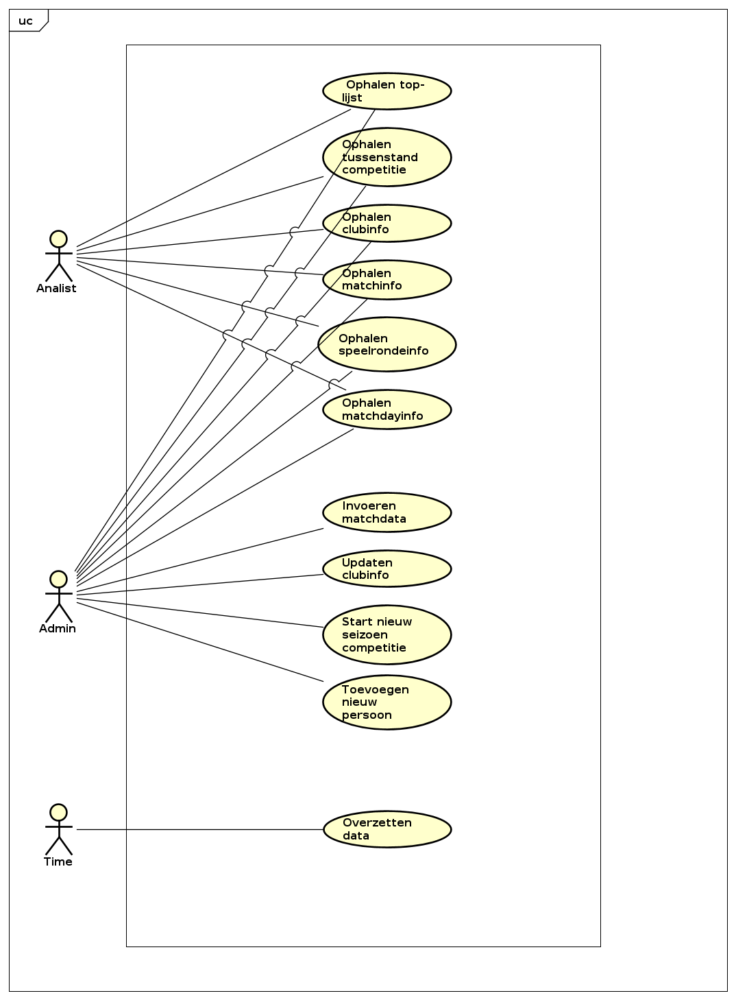
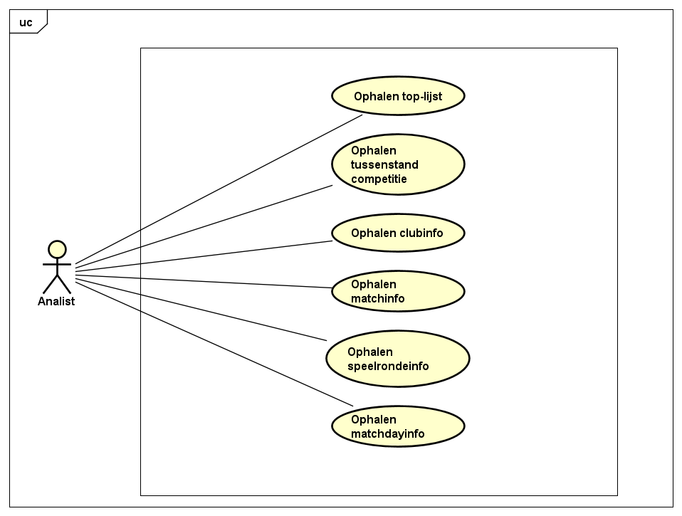
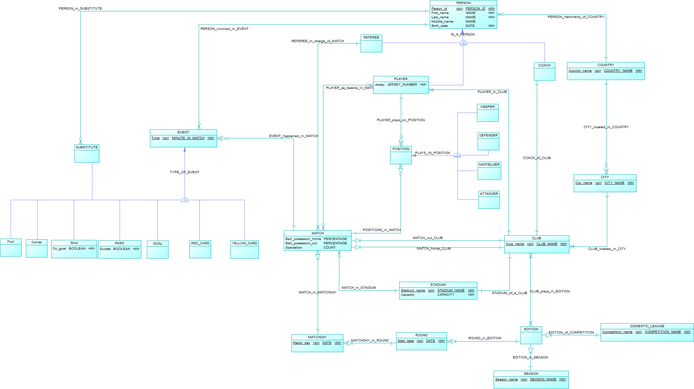

# ***Disclaimer*** | De lay-out van de PDF-versie voor dit document kan verschillen met de markdown versie, voor een accurate weergave zie markdown bestand in [bitbucket](https://isebitbucket.aimsites.nl/projects/S22122A4/repos/football-league-manager/browse/docs).

# Functioneel ontwerp

- [Use cases](#use-cases)
- [Fully-Dressed Use-cases](#fully-dressed-use-cases)
- [Verwoordingen feittypen](#verwoordingen-feittypen)
  - [Competitie](#competitie)
  - [Seizoen](#seizoen)
  - [Editie](#editie)
  - [Clubs](#clubs)
  - [Land](#land)
  - [Thuisstad](#thuisstad)
  - [Stadion](#stadion)
  - [Personen](#personen)
    - [Persoon achternaam](#persoon-achternaam)
    - [Persoon middelnaam](#persoon-middelnaam)
    - [Geboortedatum](#geboortedatum)
    - [Nationaliteit](#nationaliteit)
  - [Coach](#coach)
  - [Spelers](#spelers)
    - [Rugnummer](#rugnummer)
    - [Speler in club](#speler-in-club)
  - [Speelronde](#speelronde)
  - [Speeldag](#speeldag)
  - [Voetbalwedstrijd](#voetbalwedstrijd)
    - [Positie](#positie)
    - [Reserve](#reserve)
    - [Balbezit UIT](#balbezit-uit)
    - [Balbezit THUIS](#balbezit-thuis)
    - [Aantal toeschouwers](#aantal-toeschouwers)
  - [Events](#events)
    - [Goals](#goals)
    - [Gele kaarten](#gele-kaarten)
    - [Rode kaarten](#rode-kaarten)
    - [Wissels](#wissels)
    - [Overtredingen](#overtredingen)
    - [Hoekschoppen](#hoekschoppen)
    - [Schoten](#schoten)
    - [Passes](#passes)
  - [Scheidsrechter](#scheidsrechter)
- [Business Rules](#business-rules)
- [Functionele requirements](#functionele-requirements)
  - [Constraints](#constraints)
    - [C1 komt overeen met BR12](#c1-komt-overeen-met-br12)
    - [C3 komt overeen met BR19](#c3-komt-overeen-met-br19)
    - [C4 komt overeen met BR16](#c4-komt-overeen-met-br16)
    - [C5 komt overeen met BR17](#c5-komt-overeen-met-br17)
    - [C6 komt overeen met BR4](#c6-komt-overeen-met-br4)
    - [C7 komt overeen met BR5](#c7-komt-overeen-met-br5)
    - [C8 komt overeen met BR8](#c8-komt-overeen-met-br8)
    - [C9 komt overeen met BR9](#c9-komt-overeen-met-br9)
    - [C10 komt overeen met BR10](#c10-komt-overeen-met-br10)
    - [C11 komt overeen met BR11](#c11-komt-overeen-met-br11)
    - [C12 komt overeen met BR20](#c12-komt-overeen-met-br20)
    - [C13 komt overeen met BR21](#c13-komt-overeen-met-br21)
    - [C14 komt overeen met BR22](#c14-komt-overeen-met-br22)
    - [C15 komt overeen met BR1](#c15-komt-overeen-met-br1)
- [Ontwerpkeuzes](#ontwerpkeuzes)
  - [Person_ID](#person_id)
  - [Person_type](#person_type)
  - [Position](#position)
  - [Matchinfo](#matchinfo)
  - [Uibreidbaarheid competition](#uibreidbaarheid-competition)
  - [Matchday & Round](#matchday--round)
  - [Position](#position-1)
    - [Alleen begin wedstrijd](#alleen-begin-wedstrijd)
    - [Positie verzameling](#positie-verzameling)
    - [Positie ook in wissel](#positie-ook-in-wissel)
    - [Uiteindelijke keuze posities](#uiteindelijke-keuze-posities)
- [Rechtenstructuur](#rechtenstructuur)
- [Toelichting Datakwaliteit](#toelichting-datakwaliteit)
- [CDM](#cdm)
- [Onderbouwing concepten CDM](#onderbouwing-concepten-cdm)
  - [Entiteit PERSON](#entiteit-person)
  - [Entiteit PLAYER](#entiteit-player)
  - [Entiteit REFEREE](#entiteit-referee)
  - [Entiteit COACH](#entiteit-coach)
  - [Entiteit COUNTRY](#entiteit-country)
  - [Entiteit CITY](#entiteit-city)
  - [Entiteit CLUB](#entiteit-club)
  - [Entiteit STADIUM](#entiteit-stadium)
  - [Entiteit COMPETITION](#entiteit-competition)
- [Entitieit DOMESTIC_LEAGUE](#entitieit-domestic_league)
  - [Entiteit SEASON](#entiteit-season)
  - [Entiteit EDITION](#entiteit-edition)
  - [Entiteit ROUND](#entiteit-round)
  - [Entiteit MATCHDAY](#entiteit-matchday)
  - [Entiteit MATCH](#entiteit-match)
  - [Entiteit POSITION](#entiteit-position)
  - [Entiteit KEEPER](#entiteit-keeper)
  - [Entiteit DEFENDER](#entiteit-defender)
  - [Entiteit MIDFIELDER](#entiteit-midfielder)
  - [Entiteit ATTACKER](#entiteit-attacker)
  - [Entiteit EVENT](#entiteit-event)
  - [Entiteit SUBSTITUTE](#entiteit-substitute)
  - [Entiteit GOAL](#entiteit-goal)
  - [Entiteit RED_CARD](#entiteit-red_card)
  - [Entiteit YELLOW_CARD](#entiteit-yellow_card)
  - [Entiteit PASS](#entiteit-pass)
  - [Entiteit SHOT](#entiteit-shot)
  - [Entiteit  CORNER](#entiteit--corner)
  - [Entiteit FOUL](#entiteit-foul)
- [Testplan](#testplan)

# Use cases

## Database

## Staging Area

# Fully-Dressed Use-cases

|Naam               |Ophalen top-lijst|
|-------------------|------------------------------|
|Actors             |Data-analist Klant / NUTMEG Voetbal Admin|
|Stakeholder        ||
|Preconditie        ||
|Postconditie       |Systeem toont de gewenste top-lijst|
|Brief Description  |Actor haalt een top-lijst met gewenste informatiebehoefte op uit het systeem|
|Happy Flow         |1.Actor geeft aan een toplijst van event gele kaart op te halen   2.Systeem toont de top-lijst van gele kaarten|

|Naam               |Ophalen tussenstand competitie|
|-------------------|-----------------------------|
|Actors             |Data-analist Klant / NUTMEG Voetbal Admin|
|Stakeholder        ||
|Preconditie        ||
|Postconditie       |Systeem toont de tussenstand van de gewenste competitie tijdens het gewenste seizoen.|
|Brief Description  |Actor haalt de tussenstand van een gewenste competitie tijdens een gewenst seizoen op.|
|Happy Flow         |1.Actor geeft aan de tussenstand van een competitie op te willen halen.   2.Systeem toont de tussenstand.|
|Alternatieve Flow  |1A.Actor geeft aan een niet bestaande seizoen en competitie te hebben geselecteerd 2A. Systeem toont een lege lijst.|

|Naam               |Ophalen clubinfo|
|-------------------|-------------------------------|
|Actors             |Data-analist Klant / NUTMEG Voetbal Admin|
|Stakeholder        ||
|Preconditie        ||
|Postconditie       |Systeem toont de informatie Club naam, Stadium naam, land naam, stad naam en de caoch van de gewenste club.|
|Brief Description  |Actor haalt het team, de coach, de thuisstad, het stadion en de capaciteit van het stadion van een gewenste club op.|
|Happy Flow         |1.Actor geeft aan informatie over een gewenste club te willen zien   2.Systeem toont clubinformatie over de gewenste club.|

|Naam               |Ophalen matchinfo									|
|-------------------|---------------------------------------------------|
|Actors             |Data-analist Klant / NUTMEG Voetbal Admin|
|Stakeholder        ||
|Preconditie        ||
|Postconditie       |Systeem toont de informatie van de gewenste match.|
|Brief Description  |Actor haalt per team balbezit, passes, schoten, schoten op doel, passprecisie, overtredingen, corners, goals, kaarten en wissels van de gewenste match op.|
|Happy Flow         |1.Actor geeft aan informatie over een gewenste match te willen zien  2.Systeem toont de informatie goals, hoekschop, overtreding, passes, gele kaart ,rode kaart, schoten en vervanging van de gewenste match.|
|Alternatieve Flow  |2A.Systeem geeft aan dat de match niet bestaat.|

|Naam               |Ophalen matchdayinfo									|
|-------------------|---------------------------------------------------|
|Actors             |Data-analist Klant / NUTMEG Voetbal Admin|
|Stakeholder        ||
|Preconditie        ||
|Postconditie       |Systeem toont de informatie van de gewenste matchday.|
|Brief Description  |Actor haalt per dag wie gespeeld heeft op de dag en wat de standen zijn tussen de clubs|
|Happy Flow         |1.Actor geeft aan informatie over de gewenste dag te willen zien 2.| Systeem toont de informatie wedstrijden, goals per wedstrijd per club en de duur van de wedstrijden.
|Alternatieve Flow  |2A.Systeem geeft aan dat de matchday niet bestaat.|

|Naam               |Ophalen speelrondeinfo	|
|-------------------|-------------------------------------|
|Actors             |Data-analist Klant / NUTMEG Voetbal Admin|
|Stakeholder        ||
|Preconditie        ||
|Postconditie       |Systeem toont de informatie van de gewenste speelronde.|
|Brief Description  |Actor haalt de uitslagen en speeldagen van wedstrijden tijdens een gewenste speelronde op.|
|Happy Flow         |1.Actor geeft aan de uitslagen en speeldagen van wedstrijden tijdens een gewenste speelronde te willen zien.   2.Systeem toont van de seizoen, competitie alle start datum, club out en club thuis en de aantal goals die gemaakt zijn door de spelende clubs.|

|Naam               |Invoeren matchdata	|
|-------------------|-----------------------------------------------------|
|Actors             |NUTMEG Voetbal Admin.|
|Stakeholder        |Data-analist Klant|
|Preconditie        ||
|Postconditie       |De match met al zijn gegevens staat geregistreerd in het systeem.|
|Brief Description  |Actor voert in wie een gele/rode kaart heeft gekregen. Wie een pass, goal, schoot, overtreding, hoekschop heeft gemaakt, wie met wie is vervangen. En op welke minute de event is gebeurd.|
|Happy Flow         |1.Actor geeft aan de matchdata: goal, hoekschop, overtreding, passes, gele kaart, rode kaart, schoten en wie met wie is vervangen op te willen slaan in de database  2.Systeem slaat de match data op in de database.|
|Alternatieve Flow  |2A.Systeem geeft aan dat de ingevoerde waarde van balbezit/passprecisie niet tussen 0-100 is.   3A.Ga terug naar stap 1   -   2B.Systeem geeft aan dat speler gekoppeld aan een event/pass/corner/overtreding/schot(op doel) niet in het is correcte team zit.   3B.Ga terug naar stap 1   -   2C.Systeem geeft aan dat speler niet opgesteld is tijdens de wedstrijd.   3C.Ga terug naar stap 1.|

|Naam               |Updaten clubinfo	|
|-------------------|-------------------------------------------------------------------------------|
|Actors             |NUTMEG Voetbal Admin|
|Stakeholder        |Data-analist Klant|
|Preconditie        ||
|Postconditie       |De updated clubinformatie is opgeslagen in het systeem.|
|Brief Description  |Actor update de clubinformatie. Hieronder wordt het team, de coach, de thuisstad, het stadion en de stadioncapaciteit verstaan.|
|Happy Flow         |1.Actor geeft aan de informatie van club geüpdatet moet worden en geeft aan nieuwe informatie, team, coach, thuisstad, stadion en stdioncapaciteit in te willen voeren. 2.Systeem update de informatie.|
|Alternative FLow	|2A.Systeem geeft aan dat een speler/coach die moet worden toegevoegd nog bij een ander team ingeschreven staat.  3A. Ga terug naar stap 1.|

|Naam               |Start nieuw seizoen competitie	|
|-------------------|-------------------------------------------------------------------------------|
|Actors             |NUTMEG Voetbal Admin|
|Stakeholder        |Data-analist Klant|
|Preconditie        ||
|Postconditie       |De juiste clubs zijn gedegradeerd/gepromoveert. Een nieuw seizoen is gestart.|
|Brief Description  |Actor update de correcte clubs in de nieuwe editie, start vervolgens een leeg seizoen (lege matches, speeldrondes en een nieuwe editie).|
|Happy Flow         |1. Actor geeft aan welke clubs gedegradeerd/gepromoveert worden   2. Systeem verwerkt de gegevens   3. Actor geeft aan een nieuwe seizoen comeptitie te starten met de gegevens startdatum, speelrondes, aantal rondes per dag en de clubs die mee doen aan de competitie   4.Systeem maakt nieuwe editie met de gegevens, competitie naam, season naam, lijst met clubs, start datum, lengte van een ronde, games per dag en aantal matches per ronde|
|Alternative Flow	| 1A. Actor geeft aan een nieuwe seizoen comeptitie te starten met de verkeerde gegevens startdatum, speelrondes, aantal rondes per dag en de clubs die mee doen aan de competitie   2A. Systeem geeft een error bericht.|

|Naam               |Toevoegen nieuwe persoon	|
|-------------------|-----------------------|
|Actors             |NUTMEG Voetbal Admin|
|Stakeholder        |Data-analist Klant|
|Preconditie        | |
|Postconditie       |Nieuw persoon staat in het systeem.|
|Brief Description  |Actor zet een nieuw coach, scheidsrechter of speler in het systeem met de gegevens land, voornaam, achternaam, middelnaam, geboorte datum en voor de speler de Jersey nummer.|
|Happy Flow         |1.Actor geeft aan een nieuwe coach op te willen slaan in het systeem en geeft aan land, voornaam, achternaam, middelnaam en geboorte datum in te voeren.  2.Nieuw persoon wordt opgeslagen in de database.|
|Alternative Flow	|2A.Systeem geeft aan dat informatie onvolledig is    3A.Ga terug naar stap 1|

|Naam               |Overzetten data	|
|-------------------|-----------------------|
|Actors             |Time|
|Stakeholder        |Staging Area|
|Preconditie        ||
|Postconditie       |De gegevens vanuit de ene database zijn overgezet naar de andere database.|
|Brief Description  |Het overzetten van data gebeurt periodiek en vind elke nacht plaats om 2 uur.|
|Happy Flow         |1. Actor geeft aan dat het tijd is om de data over te zetten.  2. Systeem zet data om van de ene database naar de andere database.|

|Naam               |Toevoegen event type	|
|-------------------|-----------------------|
|Actors             |NUTMEG Voetbal Admin|
|Stakeholder        ||
|Preconditie        ||
|Postconditie       |Er is een nieuw event toegevoegd aan het systeem.|
|Brief Description  |De Actor maakt een nieuwe event type aan in het systeem, hierbij wordt een naam en optioneel een extra kolom toegevoegd.  |
|Happy Flow         |1.Actor geeft aan een nieuw event type aan te maken, vervolgens voert de actor een naam in met een extra kolom.  2.Het systeem slaat de nieuwe event type op.|
|Alternative Flow	  |2A. Systeem geeft aan dat de ingevoerde informatie onvolledig is    3A.Ga terug naar stap 1|

# Verwoordingen feittypen

In de verwoordingen zijn veel stukken tekst *italic*, **dikgedrukt** of ***italic dikgedrukt***. Dit betekent dat deze stukken tekst bij elkaar horen. Bijvoorbeeld:

> Er is een seizoen <u>19/20</u> die start op <u>**01-01-2020**</u>.
>
> ET: SEASON
>
> ID: Att Season_name
>
> Att **Season_start**

Dit betekent dat `Season_name` verwijst naar `19/20` (beide hebben geen extra styling) en `Season_start` verwijst naar `01-01-2020` omdat beide dikgedrukt zijn.

## Competitie

Er bestaat een competitie Eredivisie.

Er bestaat een competitie <u>Champions League</u>.

---

ET COMPETITIE

ID: Att Competition_name

Predicaat: Er bestaat een competitie \<Competition_name\>.

## Seizoen

Er is een seizoen 19/20 die start op 01-01-2019.

Er is een seizoen <u>19/20</u> die start op <u>*01-01-2020*</u>.

---

ET: SEASON

ID: Att Season_name

Att: *Season_start*

Predicaat: Er is een seizoen \<Season_name\> die start op \<*Season_start*\>.

---

Er is een seizoen 18/19 die eindigt op 30-10-2020.

Er is een seizoen <u>19/20</u> die eindigt op <u>30-10-2021</u>.

---

ET: SEASON

MATCH

Att: Season_end

Predicaat: Er is een seizoen \<Season_name\> die eindigt op \<*Season_end*\>.

## Editie

In seizoen 17/18 vond er een editie van de eredivisie plaats.

In seizoen <u>**19/20**</u> vond er een editie van de <u>*WK*</u> plaats.

---

ET: EDITION

ID: ET **SEASON** + ET *COMPETITION*

MATCH MATCH

---

RT EDITION_of_COMPETITION tussen EDITION(afhankelijk) en *COMPETITION*.

RT EDITION_in_SEASON tussen EDITION(afhankelijk) en **SEASON**.

Predicaat: In seizoen \<**Season_name**\> vond er een editie van de \<*Competion_name*\> plaats.

## Clubs

De club Manchester United doet mee aan de competitie Eredivisie in het seizoen 17/18.

De club <u>*Vitesse*</u> doet mee aan de competitie <u>Eredivisie in het seizoen 17/18</u>.

---

ET *CLUB*

ID: Att Club_name

---

ET: EDITION

MATCH

---

RT CLUB_plays_in_EDITION tussen *CLUB* en EDITION.

Predicaat: De club \<*Club_name*\> doet mee aan de competitie \<Competion_name\> in het seizoen \<Season_name\>.

## Land

Er bestaat een land genaamd Duitsland.

Er bestaat een land genaamd <u>Nederland</u>.

---

ET: COUNTRY

ID: Att Country_name

Predicaat: Er bestaat een land genaamd \<Country_name\>.

## Thuisstad

De club Manchester United heeft als thuisstad Manchester.

De club <u>Vitesse</u> heeft als thuisstad <u>*Arnhem* in **Nederland**</u>.

---

ET CLUB

MATCH

---

ET *CITY*

ID: Att *City_name* + ET **COUNTRY**

**MATCH**

---

RT: CLUB_in_CITY tussen CLUB en *CITY*.

Predicaat: De club \<Club_name\> heeft als thuisstad \<*City_name*\> in \<**Country_name**\>.

## Stadion

Het stadion Old Trafford bevat 47.140 stoelen.

Het stadion <u>Gelredome</u> bevat <u>*28.000*</u> stoelen.

---

ET: STADIUM

ID: Att Stadium_name

Att *Capacity*

Predicaat: Het stadion \<Stadium_name\> bevat \<*Capacity*\> stoelen.

## Personen

De persoon 45 heeft als voornaam henk.

De persoon <u>7</u> heeft als naam <u>*Elmar*</u>.

---

ET: PERSON

ID: Att Person_id

Att *First_name*

Predicaat: De persoon \<Person_id\> heeft als naam \<*First_name*\>.

### Persoon achternaam

De persoon 7 heeft als achternaam Wiese.

De persoon <u>45</u> heeft als achternaam <u>*Boss*</u>.

ET: PERSON

MATCH

Att *Last_name*

Predicaat: De persoon \<Person_id\> heeft als achternaam \<*Last_name*\>.

### Persoon tussenvoegsel

De persoon 123 heeft als tussenvoegsel van de.

De persoon <u>45</u> heeft als tussenvoegsel <u>*de*</u>.

---

ET: PERSON

MATCH

Att *Middle_name*

Predicaat: De persoon \<Person_id\> heeft als tussenvoegsel \<*Middle_name*\>.

### Geboortedatum

De persoon 11 is geboren op 11 februari 1996.

De persoon <u>364524144</u> is geboren op <u>*8 Maart 1929*</u>.

ET: PERSON

MATCH

Att *Birth_date*

Predicaat: De persoon \<Person_id\> is geboren op \<*Birth_date*\>.

### Nationaliteit

De persoon 11 heeft een nederlandse paspoort.

De persoon <u>122343</u> heeft een <u>*Zuid-Afrika*</u> paspoort.

ET: PERSON

MATCH

---

ET: *COUNTRY*

*MATCH*

---

RT PERSON_nationality_of_COUNTRY tussen PERSON en *COUNTRY*.

Predicaat: De persoon \<Person_id\> heeft een \<*Country_name*\> paspoort.

## Coach

De coach van Manchester United is persoon 3.

De coach van <u>Vitesse</u> is persoon <u>*9876*</u>.

---

ET: CLUB

MATCH

---

ET: *COACH*

SUBTYPE (PERSON)

*MATCH*

---

RT COACH_of_CLUB tussen CLUB en *COACH*.

Predicaat: De coach van \<Club_name\> is persoon \<*Person_id*\>.

## Spelers

### Rugnummer

De speler 90 heeft rugnummer 26.

De speler <u>56</u> heeft rugnummer <u>*14*</u>.

---

ET: PLAYER

SUBTYPE (PERSON)

MATCH

Att *Jersey*

Predicaat: De speler \<Person_id\> heeft rugnummer \<*Jersey*\>.

### Speler in club

De speler 12 zit in club Ajax.

De speler <u>1234132412</u> zit in <u>*PSV*</u>.

---

ET: PLAYER

MATCH

---

ET: *CLUB*

*MATCH*

---

RT PLAYER_in_CLUB tussen PLAYER en *CLUB*.

Predicaat: De speler \<Person_id\> zit in \<*Club_name*\>.

## Speelronde

Er is een speelronde in het seizoen 19/20 in de competitie Eredivisie die op 01-01-2019 start.

Er is een speelronde in het seizoen <u>20/21 in de competitie LaLiga</u> die op <u>*01-01-2020*</u> start.

---

ET: ROUND

ID: ET: EDITION + Att *Start_date*

MATCH

Predicaat: Er is een speelronde in het seizoen \<Season_name\> in de competitie \<Competition_name\> die op \<*Start_date*\> start.

## Speeldag

Er is een speeldag die valt op 02-01-2019 binnen de speelronde van het seizoen 19/20 in de competitie Eredivisie die op 01-01-2019 start.

Er is een speeldag die valt op <u>02-01-2020</u> binnen de speelronde van <u>*het seizoen 20/21 in de competitie LaLiga die op 01-01-2020 start*</u>.

---

ET: MATCHDAY

ID: ET: *ROUND* + Att Match_day

*MATCH*

Predicaat: Er is een speeldag die valt op \<Match_day\> binnen de speelronde van het seizoen \<*Season_name*\> in de competitie \<*Competition_name*\> die op \<*Start_date*\> start.

## Voetbalwedstrijd

Er is een voetbalwedstrijd op 16 maart 2019 in de speelronde van het seizoen 19/20 in de competitie Eredivisie die start op 15 maart 2019 tussen thuis team Ajax en uit team Feyenoord.

Er is een voetbalwedstrijd op <u>5 januari 2020 in de speelronde van het seizoen 20/21 in de competitie LaLiga die start op 3 januari 2020 tussen thuis team *FC Barcelona* en uit team **FC Madrid**</u>.

---

ET: MATCH

ID: ET MATCHDAY + ET *CLUB* + ET **CLUB**

MATCH *MATCH* **MATCH**

RT MATCH_in_MATCHDAY tussen MATCH(afhankelijk) en MATCHDAY.

RT MATCH_home_CLUB tussen MATCH(afhankelijk) en *CLUB*.

RT MATCH_out_CLUB tussen MATCH(afhankelijk) en **CLUB**.

Predicaat: Er is een voetbalwedstrijd op \<Match_day\> in de speelronde van het seizoen \<Season_name\> in de competitie \<Competition_name\> die start op \<Start_date\> tussen thuis team \<*Club_name*\> en uit team \<**Club_name**\>.

### Positie

Tijdens de voetbalwedstrijd op 16 maart 2019 tussen thuis team Ajax en uit team Feyenoord in de speelronde 15 maart 2019 in het seizoen 19/20 in competitie Eredivisie begint de speler 15 op de positie aanvaller.

Tijdens de voetbalwedstrijd op <u>5 januari 2020 tussen thuis team FC Barcelona en uit team FC Madrid in de speelronde 3 januari 2020 in het seizoen 20/21 in competitie LaLiga begint de speler *21*</u> op de positie <u>**middenvelder**</u>.

---

ET **POSITION**

ID: Att: **Position_type**

---

ET LINEUP

ID: ET MATCH + ET *PLAYER*

MATCH *MATCH*

---

RT PLAYER_plays_on_LINEUP tussen LINEUP en *PLAYER*.

RT LINEUP_in_MATCH tussen LINEUP en MATCH.

RT POSITION_in_LINEUP tussen LINEUP en **POSITION**.

Predicaat: Tijdens de voetbalwedstrijd op \<Match_day\> tussen thuis team \<Club_name\> en uit team \<Club_name\> in de speelronde \<Start_date\> in het seizoen \<Season_name\> in competitie \<Competition_name\> heeft de speler \<*Person_id*\> de positie \<**Position_type**\>.

### Reserve

Tijdens de voetbalwedstrijd op 17 maart 2019 tussen thuis team Ajax thuis en uit team Feyenoord uit in de speelronde 15 maart 2019 in het seizoen 19/20 in competitie Eredivisie begon de speler 7 als reserve.

Tijdens de voetbalwedstrijd op <u>5 januari 2020 tussen thuis team FC Barcelona thuis en uit team FC Madrid uit in de speelronde 3 januari 2020 in het seizoen 20/21 in competitie LaLiga</u> begon de speler <u>*23*</u> als reserve.

---

ET: MATCH

MATCH

---

ET: *PLAYER*

*MATCH*

---

RT PLAYER_as_reserve_in_MATCH tussen *PLAYER* en MATCH.

Predicaat: Tijdens de voetbalwedstrijd op \<Match_day\> tussen thuis team \<Club_name\> thuis en uit team \<Club_name\> uit in de speelronde \<Start_date\> in het seizoen \<Season_name\> in competitie \<Competition_name\> begin de speler \<*Speler_id*\> als reserve.

### Balbezit UIT

Tijdens de voetbalwedstrijd op 3 februari 2014 tussen thuis team ajax en uit psv in de speelronde 1 februari 2014 in het seizoen 14/15 in competitie keuken kampioen divisie heeft de uit team 36 balbezit

Tijdens de voetbalwedstrijd op <u>4 maart 2020 tussen thuis team FC Barcelona en uit team FC Madrid in de speelronde 3 maart 2020 in het seizoen 19/20 in competitie LaLiga</u> heeft het uit team <u>*32%*</u> balbezit.

---

ET: MATCH

MATCH

Att *Ball_possession_out*

Predicaat: Tijdens de voetbalwedstrijd op \<Match_day\> tussen thuis team \<Club_name\> en uit team \<Club_name\> in de speelronde \<Start_date\> in het seizoen \<Season_name\> in competitie \<Competition_name\> heeft het uit team \<*Ball_possession_out*\> balbezit.

### Balbezit THUIS

Tijdens de voetbalwedstrijd op 3 februari 2014 tussen thuis team ajax en uit psv in de speelronde 1 februari 2014 in het seizoen 14/15 in competitie keuken kampioen divisie heeft de thuis team 36 balbezit

Tijdens de voetbalwedstrijd op <u>4 maart 2020 tussen thuis team FC Barcelona en uit team FC Madrid in de speelronde 3 maart 2020 in het seizoen 19/20 in competitie LaLiga</u> heeft het thuis team <u>*68%*</u> balbezit.

---

ET: MATCH

MATCH

Att *Ball_possession_home*

Predicaat: Tijdens de voetbalwedstrijd op \<Match_day\> tussen thuis team \<Club_name\> en uit team \<Club_name\> in de speelronde \<Start_date\> in het seizoen \<Season_name\> in competitie \<Competition_name\> heeft het thuis team \<*Ball_possession_home*\> balbezit.

### Aantal toeschouwers

Tijdens de voetbalwedstrijd op 4 maart 2020 tussen thuis team FC Barcelona en uit team FC Madrid in de speelronde 3 maart 2020 in het seizoen 19/20 in competitie LaLiga was het aantal toeschouwers 40000.

Tijdens de voetbalwedstrijd op <u>4 maart 2020 tussen thuis team FC Barcelona en uit team FC Madrid in de speelronde 3 maart 2020 in het seizoen 19/20 in competitie LaLiga</u> was het aantal toeschouwers <u>30000</u>.

---

ET: MATCH

MATCH

Att Spectator_count

Predicaat: Tijdens de voetbalwedstrijd op \<Match_day\> tussen thuis team \<Club_name\> en uit team \<Club_name\> in de speelronde \<Start_date\> in het seizoen \<Season_name\> in competitie \<Competition_name\> was het aantal toeschouwers \<Spectator_count\>.

## Events

Tijdens de voetbalwedstrijd op 16 maart 2019 tussen thuis team Ajax thuis en uit team Feyenoord uit in de speelronde 15 maart 2019 in het seizoen 19/20 in competitie Eredivisie is er in in de 57ste minuut iets gebeurd waar speler 11 iets mee te maken heeft.

Tijdens de voetbalwedstrijd op <u>*5 januari 2020 tussen thuis team FC Barcelona thuis en uit team FC Madrid uit in de speelronde 3 januari 2020 in het seizoen 20/21 in competitie LaLiga*</u> is er in in de <u>*32ste* minuut iets gebeurd waar speler **32** iets mee te maken heeft</u>.

---

ET: EVENT

ID: ET MATCH + ET **PLAYER** + Att *Time*

MATCH **MATCH**

RT PERSON_involved_in_EVENT tussen EVENT en **PLAYER**.

RT EVENT_happend_in_MATCH tussen EVENT(afhankelijk) en MATCH.

Predicaat: Tijdens de voetbalwedstrijd op \<Match_day\> tussen thuis team \<Club_name\> en uit team \<Club_name\> in de speelronde \<Start_date\> in het seizoen \<Season_name\> in competitie \<Competition_name\> is er in de \<*Time*\>ste minuut iets gebeurd waar speler \<**Person_id**\> iets mee te maken heeft.

### Goals

Tijdens de voetbalwedstrijd op 5 januari 2020 tussen thuis team FC Barcelona en uit team FC Madrid in de speelronde 3 januari 2020 in het seizoen 19/20 in competitie LaLiga heeft het uit team 5 goals gescoord.

Tijdens de voetbalwedstrijd op <u>5 januari 2020 tussen thuis team FC Barcelona thuis en uit team FC Madrid uit in de speelronde 3 januari 2020 in het seizoen 20/21 in competitie LaLiga</u> heeft speler <u>*55* gescoord in de *48ste* minuut</u>.

---

ET: *MATCH*

MATCH

---

ET: **PLAYER**

MATCH

---

ET: GOAL

SUBTYPE (EVENT)

MATCH

---

Predicaat: Tijdens de voetbalwedstrijd op \<Match_day\> tussen thuis team \<Club_name\> thuis en uit team \<Club_name\> uit in de speelronde \<Start_date\> in het seizoen \<Season_name\> in competitie \<Competition_name\> heeft speler \<*Person_id*\> gescoord in de \<*Time*\> minuut.

### Gele kaarten

Tijdens de voetbalwedstrijd op 4 maart 2020 tussen thuis team FC Barcelona en uit team FC Madrid in de speelronde 3 maart 2020 in het seizoen 19/20 in competitie LaLiga heeft de speler 55 1 gele kaart gekregen in de 70ste minuut.

Tijdens de voetbalwedstrijd op <u>4 maart 2020 tussen thuis team FC Barcelona en uit team FC Madrid in de speelronde 3 maart 2020 in het seizoen 19/20 in competitie LaLiga</u> heeft de speler <u>*22* gele kaart gekregen in de **30ste** minuut</u>.

---

ET: MATCH

MATCH

---

ET: *PLAYER*

*MATCH*

---

ET: YELLOW_CARD

SUBTYPE (EVENT)

MATCH

---

Predicaat: Tijdens de voetbalwedstrijd op \<Match_day\> tussen thuis team \<Club_name\> en uit team \<Club_name\> in de speelronde \<Start_date\> in het seizoen \<Season_name\> in competitie \<Competition_name\> heeft de speler \<*Person_id*\> gele kaart gekregen in de \<**Time**\> minuut.

### Rode kaarten

Tijdens de voetbalwedstrijd op 15 januari 2019 tussen thuis team Ajax en uit team Feyenoord in de speelronde 13 januari 2019 in het seizoen 19/20 in competitie Eredivise heeft de speler 6 gele kaart gekregen in de 59ste minuut.

Tijdens de voetbalwedstrijd op <u>4 maart 2020 tussen thuis team FC Barcelona en uit team FC Madrid in de speelronde 3 maart 2020 in het seizoen 20/21 in competitie LaLiga</u> heeft de speler <u>*22* gele kaart gekregen in de **30ste** minuut</u>.

---

ET: MATCH

MATCH

---

ET: *PLAYER*

*MATCH*

---

ET: RED_CARD

SUBTYPE (EVENT)

MATCH

---

Predicaat: Tijdens de voetbalwedstrijd op \<Match_day\> tussen thuis team \<Club_name\> en uit team \<Club_name\> in de speelronde \<Start_date\> in het seizoen \<Season_name\> in competitie \<Competition_name\> heeft de speler \<*Person_id*\> rode kaart gekregen in de \<**Time**\> minuut.

### Wissels

Tijdens de voetbalwedstrijd op 4 maart 2020 tussen thuis team FC Barcelona en uit team FC Madrid in de speelronde 3 maart 2020 in het seizoen 19/20 in competitie LaLiga werdt de speler 33 ingewisseld voor speler 1111 in de 30ste minuut.

Tijdens de voetbalwedstrijd op <u>4 maart 2020 tussen thuis team FC Barcelona en uit team FC Madrid in de speelronde 3 maart 2020 in het seizoen 19/20 in competitie LaLiga</u> werd de speler <u>*55* ingewisseld voor de speler **66** in de ***40ste*** minuut</u>.

---

ET: MATCH

MATCH

---

ET: *PLAYER*

*MATCH*

---

ET: **PLAYER**

**MATCH**

---

ET: SUBSTITUTE

SUBTYPE (EVENT)

---

RT PERSON_in_SUBSTITUTE tussen *PLAYER*** en SUBSTITUTE.

Predicaat: Tijdens de voetbalwedstrijd op \<Match_day\> tussen thuis team \<Club_name\> en uit team \<Club_name\> in de speelronde \<Start_date\> in het seizoen \<Season_name\> in competitie \<Competition_name\> werd de speler \<*Person_id*\> ingewisseld voor de speler \<**Person_id**\> in de \<***Time***\> minuut.

### Overtredingen

Tijdens de voetbalwedstrijd op 4 maart 2020 tussen thuis team FC Barcelona en uit team FC Madrid in de speelronde 3 maart 2020 in het seizoen 19/20 in competitie LaLiga heeft de speler 55 in de 70ste minuut een overtreding gemaakt.

Tijdens de voetbalwedstrijd op <u>4 maart 2020 tussen thuis team FC Barcelona en uit team FC Madrid in de speelronde 3 maart 2020 in het seizoen 19/20 in competitie LaLiga</u> heeft de speler <u>*22* in de **30ste** minuut een overtreding gemaakt</u>.

---

ET: MATCH

MATCH

---

ET: *PLAYER*

*MATCH*

---

ET: FOUL

SUBTYPE (EVENT)

MATCH

---

Predicaat: Tijdens de voetbalwedstrijd op \<Match_day\> tussen thuis team \<Club_name\> en uit team \<Club_name\> in de speelronde \<Start_date\> in het seizoen \<Season_name\> in competitie \<Competition_name\> heeft de speler \<*Person_id*\> in de \<**Time**\> minuut een overtreding gemaakt.

### Hoekschoppen

Tijdens de voetbalwedstrijd op 4 maart 2020 tussen thuis team FC Barcelona en uit team FC Madrid in de speelronde 3 maart 2020 in het seizoen 19/20 in competitie LaLiga heeft de speler 55 in de 70ste minuut een hoekschop genomen.

Tijdens de voetbalwedstrijd op <u>4 maart 2020 tussen thuis team FC Barcelona en uit team FC Madrid in de speelronde 3 maart 2020 in het seizoen 19/20 in competitie LaLiga</u> heeft de speler <u>*22* in de **30ste** minuut een hoekschop genomen</u>.

---

ET: MATCH

MATCH

---

ET: *PLAYER*

*MATCH*

---

ET: FOUL

SUBTYPE (EVENT)

MATCH

---

Predicaat: Tijdens de voetbalwedstrijd op \<Match_day\> tussen thuis team \<Club_name\> en uit team \<Club_name\> in de speelronde \<Start_date\> in het seizoen \<Season_name\> in competitie \<Competition_name\> heeft de speler \<*Person_id*\> in de \<**Time**\> minuut een hoekschop genomen.

### Schoten

Tijdens de voetbalwedstrijd op 4 maart 2020 tussen thuis team FC Barcelona en uit team FC Madrid in de speelronde 3 maart 2020 in het seizoen 19/20 in competitie LaLiga heeft de speler 55 in de 70ste minuut een schot welke niet op goal is gemaakt.

Tijdens de voetbalwedstrijd op <u>4 maart 2020 tussen thuis team FC Barcelona en uit team FC Madrid in de speelronde 3 maart 2020 in het seizoen 19/20 in competitie LaLiga</u> heeft de speler <u>*22* in de **30ste** minuut een schot ***welke wel op goal is*** gemaakt</u>.

---

ET: MATCH

MATCH

---

ET: *PLAYER*

*MATCH*

---

ET: SHOT

SUBTYPE (EVENT)

MATCH

Att ***On_goal***

---

Predicaat: Tijdens de voetbalwedstrijd op \<Match_day\> tussen thuis team \<Club_name\> en uit team \<Club_name\> in de speelronde \<Start_date\> in het seizoen \<Season_name\> in competitie \<Competition_name\> heeft de speler \<*Person_id*\> in de \<**Time**\> minuut een schot \<***On_goal***\> gemaakt.

### Passes

Tijdens de voetbalwedstrijd op 4 maart 2020 tussen thuis team FC Barcelona en uit team FC Madrid in de speelronde 3 maart 2020 in het seizoen 19/20 in competitie LaLiga heeft de speler 55 in de 70ste minuut onsuccesvol gepasst naar een andere speler.

Tijdens de voetbalwedstrijd op <u>4 maart 2020 tussen thuis team FC Barcelona en uit team FC Madrid in de speelronde 3 maart 2020 in het seizoen 19/20 in competitie LaLiga</u> heeft de speler <u>*22* in de **30ste** minuut ***succesvol*** gepasst naar een andere speler</u>.

---

ET: MATCH

MATCH

---

ET: *PLAYER*

*MATCH*

---

ET: SHOT

SUBTYPE (EVENT)

MATCH

Att ***Success***

---

Predicaat: Tijdens de voetbalwedstrijd op \<Match_day\> tussen thuis team \<Club_name\> en uit team \<Club_name\> in de speelronde \<Start_date\> in het seizoen \<Season_name\> in competitie \<Competition_name\> heeft de speler \<*Person_id*\> in de \<**Time**\> minuut \<***Success***\> gepasst naar een andere speler.

## Scheidsrechter

Tijdens de voetbalwedstrijd op 16 januari 2019 tussen thuis team Ajax en uit team Feyenoord in de speelronde 14 januari 2019 in het seizoen 19/20 in competitie Eredivisie was persoon 53 de scheidsrechter.

Tijdens de voetbalwedstrijd op <u>4 maart 2020 tussen thuis team FC Barcelona en uit team FC Madrid in de speelronde 3 maart 2020 in het seizoen 20/21 in competitie LaLiga</u> was persoon <u>*12*</u> de scheidsrechter.

---

ET: *MATCH*

MATCH

---

ET: *REFEREE*

SUBTYPE (PERSON)

*MATCH*

RT REFEREE_in_charge_of_MATCH tussen *REFEREE* en MATCH.

Predicaat: Tijdens de voetbalwedstrijd op \<Match_day\> tussen thuis team \<Club_name\> en uit team \<Club_name\> in de speelronde \<Start_date\> in het seizoen \<Season_name\> in competitie \<Competition_name\> was persoon \<*Person_id*\> de scheidsrechter.

# Business Rules

- BR1 Van een lopende competitie mag alleen de selectie clubs en de speeldatum van een wedstrijd worden aangepast;
- BR2 Een thuis club mag maximaal één keer tegen een uit club spelen binnen een competitie seizoen;
- BR3 De startdatum van een ronde moet lager zijn dan de einddatum van het bijhorende seizoen;
- BR4 De datum van een speeldag moet na de gekoppelde startdatum van de speelronde liggen;
- BR5 De startdatum van een speeldag moet voor de startdatum van een opvolgende ronde bestaan en moet hetzelfde zijn of na de startdatum van de gekoppelde ronde bestaan;
- BR6 Een speler die op het veld staat kan een keeper, verdediger, aanvaller of middenvelder zijn;
- BR7 Een thuis club mag maximaal één keer tegen een uit club spelen binnen een fase van een knockout competitie;
- BR8 Een speler die in een wedstrijd speelt moet op dat moment lid zijn van een bestaande, spelende club;
- BR9 Clubs mogen alleen een match spelen als ze meedoen aan de editie;
- BR10 Gele en rode kaarten mogen alleen worden gegeven aan spelers en coaches;
- BR11 Voor alleen spelende spelers wordt bijgehouden of ze hebben geschoten, pases hebben gemaakt, zijn gewisseld, overtredingen hebben gemaakt, corners hebben afgenomen of gescored hebben tijdens een voetbalwedstrijd;
- BR12 Er moeten 22 spelers op het veld ingedeeld zijn bij een wedstrijd;
- BR13 Voor coaches wordt bijgehouden voor welke club wordt gecoached;
- BR14 Voor scheidsrechters wordt bijgehouden voor welke wedstrijd(en) wordt gescheidst;
- BR15 Voor spelers wordt bijgehouden wie in reserve staat bij een wedstrijd;
- BR17 Een rugnummer van een speler mag niet hoger zijn dan 99 en kleiner zijn dan 1;
- BR18 Er mag minimaal en maximaal 1 coach per club zijn;
- BR19 Een persoon mag niet jonger zijn dan 15 jaar;
- BR20 Aantal toeschouwers mag niet groter zijn dan de capaciteit van een stadion;
- BR21 De waarde van de minuten binnen een wedstrijd mag niet negatief zijn.

# Functionele requirements

| Functional Requirements                                                                                                          | MoSCoW | Use case                       |
|----------------------------------------------------------------------------------------------------------------------------------|--------|--------------------------------|
| Bij een lopende competitie mag alleen de speeldatum of speler selectie van een wedstrijd worden veranderd                        | M      | Invoeren matchdata             |
| Als \[admin\] wil ik een doelpunt in minuut 21 door Ronaldo als matchdata invoeren voor de wedstrijd Manchester United - Chelsea | M      | Invoeren matchdata             |
| Als \[admin\] wil ik een rode kaart in minuut 90 voor Messi als matchdata invoeren voor de wedstrijd PSG - Real Madrid           | M      | Invoeren matchdata             |
| Als \[admin\] wil ik een gele kaart in minuut 2 voor Pepe als matchdata invoeren voor de wedstrijd Porto - Feyenoord             | M      | Invoeren matchdata             |
| Als \[admin\] wil ik een overtreding in minuut 63 door Pique als matchdata invoeren voor de wedstrijd FC Barcelona - Real Madrid | M      | Invoeren matchdata             |
| Als \[admin\] wil ik een corner in minuut 34 door Neymar als matchdata invoeren voor de wedstrijd PSG - Bayern                   | M      | Invoeren matchdata             |
| Als \[admin\] wil ik een schot op doel in minuut 87 door Antony als matchdata invoeren voor de wedstrijd Ajax - Feyenoord        | M      | Invoeren matchdata             |
| Als \[admin\] wil ik speler Lionel Messi toewijzen aan de club Ajax                                                              | M      | Updaten clubinfo               |
| Als \[admin\] wil ik coach Josep Guardiola toewijzen aan de club Ajax                                                            | M      | Updaten clubinfo               |
| Als \[admin\] wil ik een nieuwe seizoen voor de Eredivise starten                                                                | M      | Start nieuw seizoen competitie |
| Als \[admin\] wil ik een nieuwe speler met de naam Chris toevoegen                                                               | M      | Toevoegen nieuw persoon        |
| Als \[admin\] wil ik een nieuwe coach met de naam Michel toevoegen                                                               | M      | Toevoegen nieuw persoon        |
| Als \[admin\] wil ik een nieuwe scheidsrechter met de naam Henk toevoegen                                                        | M      | Toevoegen nieuw persoon        |
| Als \[admin\] wil ik een knock-out tournament seizoen kunnen starten.															  | S      | Start nieuw seizoen KO         |
| Als \[analist\] wil ik de top-lijst van voetballers met de meeste doelpunten in seizoen 2015/2016 uitlezen                       | M      | Ophalen top-lijst              |
| Als \[analist\] wil ik de top-lijst van voetballers met de meeste gele kaarten in seizoen 2010/2011 uitlezen                     | M      | Ophalen top-lijst              |
| Als \[analist\] wil ik de top-lijst van voetballers met de meeste rode kaarten in seizoen 2022/2023 uitlezen                     | M      | Ophalen top-lijst              |
| Als \[analist\] wil ik de top-lijst van voetballers met de meeste overtredingen in seizoen 2021/2022 uitlezen                    | M      | Ophalen top-lijst              |
| Als \[analist\] wil ik de top-lijst van clubs met de meeste corners in seizoen 2000/2001 uitlezen                                | M      | Ophalen top-lijst              |
| Als \[analist\] wil ik de top-lijst van clubs met de meeste schoten op doel in seizoen 1967/1968 uitlezen                        | M      | Ophalen top-lijst              |
| Als \[analist\] wil ik de positie van Ajax in de Erdivisie tijdens seizoen 20/21 uitlezen                                        | M      | Ophalen tussenstand competitie |
| Als \[analist\] wil ik het aantal doelpunten van Feyenoord in de Erdivisie tijdens het seizoen 16/17 uitlezen                    | M      | Ophalen tussenstand competitie |
| Als \[analist\] wil ik het aantal gewonnen wedstrijden van Feyenoord in de Erdivisie tijdens het seizoen 10/11 uitlezen          | M      | Ophalen tussenstand competitie |
| Als \[analist\] wil ik informatie over de spelers van de club Ajax uitlezen                                                      | M      | Ophalen clubinfo               |
| Als \[analist\] wil ik informatie over de coach van de club Ajax uitlezen                                                        | M      | Ophalen clubinfo               |
| Als \[analist\] wil ik informatie over de stadion van de club Ajax uitlezen                                                      | M      | Ophalen clubinfo               |
| Als \[analist\] wil ik informatie over de balbezit van Ajax tegen Feyenoord uitlezen                                             | M      | Ophalen matchinfo              |
| Als \[analist\] wil ik informatie over de toeschouwers tijdens Ajax - Feyenoord uitlezen                                         | M      | Ophalen matchinfo              |
| Als \[analist\] wil ik informatie over speelronde 34 van de Eredivisie uitlezen                                                  | M      | Ophalen speelrondeinfo         |
| Als \[analist\] wil ik informatie over de wedstrijd op 12/04/2021 tussen Feyenoord - Vitesse in de Eredivisie uitlezen           | M      | Ophalen speelrondeinfo         |
| Als \[analist\] wil ik informatie over brackets voor een knock-out tournament           											| S      | Ophalen brackets KO            |

## Constraints

### C1 komt overeen met BR12

- Betreft: ET `POSITION`;
- Specificatie: Er zijn minimaal 7 en maximaal 11 spelers per club opgesteld wanneer een wedstrijd start.

### C3 komt overeen met BR19

- Betreft: ET `COACH` en ET `CLUB`;
- Specificatie: Minimaal en maximaal 1 coach per club.

### C4 komt overeen met BR16

- Betreft: ET `ROUND`, ET `EDITION` en ET `DOMESTIC_LEAGUE`;
- Specificatie: Maximaal 52 speelrondes per editie van een competitie.

### C5 komt overeen met BR17

- Betreft: ET `PLAYER` en Att `Jersey`;
- Specificatie: Een rugnummer van een speler mag niet hoger zijn dan 99 en kleiner zijn dan 1.

### C6 komt overeen met BR4

- Betreft: ET `ROUND`, Att `Start_date`, en ET `SEASON`, Att `Start_date` en `End_date`;
- Specificatie: De startdatum van een speelronde ligt binnen de start- en einddatum van het bijbehorende seizoen. <!-- TODO: SEASON heeft geen start datum -->

### C7 komt overeen met BR5

- Betreft: ET `MATCHDAY`, Att `Match_day`, en ET `ROUND`, Att `Start_date`;
- Specificatie: De startdatum van een speeldag moet voor de startdatum van een opvolgende speelronde zijn, maar hetzelfde of na de startdatum van de gekoppelde speelronde.

### C8 komt overeen met BR8

- Betreft: ET `MATCH` en ET `EDITION`;
- Specificatie: Een speler in een wedstrijd moet op dat moment lid zijn van de thuis- of uitspelende club.

### C9 komt overeen met BR9

- Betreft: ET `MATCH` en ET `EDITION`;
- Specificatie: Een club mag alleen meedoen aan een wedstrijd als ze ook aan de bijbehorende editie.

### C10 komt overeen met BR10

- Betreft: ET `YELLOW_CARD`, ET `RED_CARD`, ET `COACH` en ET `PLAYER`;
- Specificatie: Een gele of rode kaart mag alleen aan een speler of een coach gegeven worden.

### C11 komt overeen met BR11

- Betreft: ET `PASS`, ET `GOAL`, ET `SHOT`, ET `FOUL`, ET `CORNER` en ET `SUBSTITUTE`;
- Specificatie: Alleen voor spelende spelers in een wedstrijd worden het aantal schoten, het aantal passes, de wissels, de overtredingen, de corners en of de persoon heeft gescoord bijgehouden.

### C12 komt overeen met BR20

- Betreft: ET `PERSON`, Att `Birth_date`;
- Specificatie: Een peroon binnen het systeem mag niet jonger zijn dan 15 jaar oud.

### C13 komt overeen met BR21

- Betreft: ET `MATCH` en ET `STADIUM`, Att `Capacity`;
- Specificatie: Het aantal toeschouwers mag niet groter zijn dan de capaciteit van het stadion waar de wedstrijd wordt gehouden.

### C14 komt overeen met BR22

- Betreft: De Att `Time` van de entiteiten ET `RED_CARD`, ET `YELLOW_CARD`, ET `PASS`, ET `GOAL`, ET `SHOT`, ET `FOUL`, ET `CORNER` en ET `SUBSTITUTE`;
- Specificatie: De minuut in een wedstrijd mag niet negatief zijn.

### C15 komt overeen met BR1
- Betreft: ET `EDITITE`, ET `CLUB`, ET `PLAYER` en de Att `Match_day`van de ET `MATCHDAY`;
- Specificatie: Tijdens een lopende competitie mogen alleen de selecties van de clubs en de matchdays aangepast worden

# Ontwerpkeuzes

In dit hoofdstuk zijn de ontwerpkeuzes te vinden die tijdens het opstellen van het CDM aan bod kwamen. Per ontwerpkeuze worden zowel de gekozen implementatie als alternatieve implementaties beschreven. 

## Person_ID

Personen worden in het systeem voorzien van een uniek ID. Deze keuze is gemaakt aangezien het erg lastig is om te verzekeren dat een primary identifier op basis van de bestaande attributen ook daadwerkelijk uniek is. Wanneer je geen ID gebruikt zou je er bijvoorbeeld voor kunnen kiezen om een First_name, Middle_name, Last_name en Birth_date te kunnen gebruiken. Echter verzeker je hiermee nog steeds niet daadwerkelijk een unieke waarde.

## Person_type

Personen binnen het systeem behoren tot een van de volgende drie typen: COACH, PLAYER of REFEREE. Om dit aan te geven hebben we ervoor gekozen om inheritance te gebruiken, personen zijn daadwerkelijk een van de drie typen. We hadden er ook voor kunnen kiezen person_type een attribuut van person te maken, echter kom je dan in de knoop met relaties en attributen. 

Zo zijn COACHES en PLAYERS verbonden aan een CLUB, maar REFEREES niet.Ook hebben PLAYERS een rugnummer terwijl COACHES en REFEREES dit niet hebben. Door inheritance te gebruiken kun je al deze typen personen hun eigen relaties en attributen geven. 

## Position

Er zijn vier soorten posities binnen ons systeem, namelijk: KEEPER, DEFENDER, MIDFIELDER en ATTACKER. We zouden ook specifiekere posities zoals bijvoorbeeld Rechtervleugelverdediger, Aanvallende middelvelder en Spits kunnen gebruiken, maar met de opdrachtgever is vastgesteld dat de vier basisposities goed genoeg zijn.

De posities van spelers worden per wedstrijd gekoppeld, spelers hebben dus geen (favoriete_)positie-attribuut.

## Matchinfo

De meeste informatie van matches wordt bijgehouden met events. Per event wordt een event_type, speler en tijdtijdstip in de wedstrijd vastgelegd. Er zijn een aantal event_typen waarbij extra informatie wordt  bijgehouden, zoals on_goal bij SHOT.

Balbezitpercentages en toeschouweraantallen worden simpelweg als attributen van match bijgehouden aangezien uitvoerende personen en tijdstippen hierbij niet relevant zijn.

## Uibreidbaarheid competition

Aangezien in de opdrachtgever heeft aangegeven dat er eventueel knock-out tournaments moeten worden toegevoegd is ervoor gekozen om COMPETITION uitbreidbaar te maken. In het uitgewerkt systeem erft COMPETITION alleen over van DOMESTIC_LEAGUE en zijn er nog geen knock-out tournaments toegevoegd.

## Matchday & Round 

We hebben ervoor gekozen om MATCHDAYS en ROUNDS als entiteiten bij te houden. Hiermee voorkom je de dubelle data die je zou krijgen wanneer je MATCHDAY en ROUND als attributen van MATCH zou bijhouden.

## Position

Posities van spelers voor en tijdens de wedstrijd kan op meerdere manieren gedaan worden. Hieronder staan er een paar met hun voor- en nadelen en wordt er toegelicht voor welke oplossing uiteindelijk gekozen is.

### Alleen begin wedstrijd

Een optie voor het bijhouden van de posities van spelers is een entiteit aanmaken genaamd `POSITION` waar de posities van de elf spelende spelers (per club) worden bijgehouden. De echte posities van de spelers (`KEEPER`, `DEFENDER`, `MIDFIELDER` en `ATTACKER`) worden aangemaakt als losse subtypen. De reserve spelers kunnen als relatie tussen `PLAYER` en `MATCH` bijgehouden worden.

Op deze manier is het niet mogelijk om een speler op een andere positie te laten spelen (een `ATTACKER` wordt bijvoorbeeld een `DEFENDER`), want de positie van een speler staat vast aan het begin van de wedstrijd (de `POSITION` entiteit) en kan niet op een andere manier worden bijgehouden.

### Positie verzameling

Een andere optie voor het bijhouden van posities is in de `POSITION` entiteit bijhouden wat alle posities van alle spelers gedurende de hele wedstrijd waren. Op deze manier kunnen de verschillende posities van de spelers achterhaald worden.

Een nadeel hiervan is dat er niet achterhaald kan worden welke `SUBSTITUTE` event bij welke `POSITION` hoort. Op deze manier is het niet mogelijk om er achter te komen vanaf wanneer een persoon op welke positie is gaan spelen.

### Positie ook in wissel

Nog een optie voor het bijhouden van posities is een combinatie van optie één en twee, alleen een groot verschil is dat de `SUBSTITUTE` event een extra kolom genaamd `Position` krijgt. Op deze manier kan er in deze kolom worden aangegeven op welke positie de persoon die er in gewisseld wordt speelt. Ook kan op deze manier een speler zelf van positie wisselen, door met zichzelf te wisselen en dan een andere positie aan te nemen in deze kolom.

Met deze oplossing komt een klein probleempje omhoog, namelijk dat er verschillende soorten posities gebruikt kunnen worden (bijvoorbeeld `KEEPER` en `GOALKEEPER`, deze zijn in principe hetzelfde, maar ze hebben een andere naam). Dit kan verholpen worden met een extra tabel. De `POSITION` tabel wordt hernoemd naar `LINEUP` (deze naam is logischer, omdat het alleen de begin posities van de spelers zijn) en er wordt een nieuwe tabel genaamd `POSITION` aangemaakt waar alle mogelijke posities in worden opgeslagen (`KEEPER`, `DEFENDER`, `MIDFIELDER` en `ATTACKER`). De `LINEUP` en `SUBSTITUTE` entiteiten krijgen een verwijzing naar deze tabel, wat er voor zorgt dat `LINEUP` en `SUBSTITUTE` nooit andere soorten posities kunnen hebben.

### Uiteindelijke keuze posities

Omdat de laatste optie ([positie ook in wissel](#positie-ook-in-wissel)) geen nadelen heeft en een combinatie is van de andere twee opties, is dit de beste optie om te gebruiken in het systeem.

# Rechtenstructuur

Voor data-analisten geldt dat ze alleen SELECT / READ rechten op alle data uit de MongoDB staging area.

Administrators hebben GRANT ALL rechten op alle data uit de MSSQL database en de MongoDB staging area.

De transport script gebruiker heeft READ rechten op de MSSQL database en READ en WRITE rechten op de MongoDB staging area.

|Afkorting | Betekenis |
|- |-
|C | Er wordt wat aangemaakt. |
|R | Er wordt wat gelezen. |
|U | Er wordt wat aangepast. |
|D | Er wordt wat verwijdert. |

| Use Cases                 | Entiteit(en)                                  | Rechten               | Beschrijving
|---------------------------|-----------------------------------------------|-----------------------|--------------|
| Ophalen Top-lijst         | Event (inc. subtypes), Match, Person, Club    | Data-Analist en Admin | Het ophalen van de volgende gegevens: Per editie wordt op volgorde gesorteerd welke spelers de meeste ballen hebben gepaast, doelpunten hebben gescoord, rode en gele kaarten hebben ontvangen, schot op goal hebben gelost, overtreding hebben gemaakt en corners hebben genomen.
| Ophalen Tussenstand Comp  | Edition, Match           | Data-Analist en Admin | Het ophalen van de volgende gegevens: Per editie wordt op volgorde gesorteerd welke teams de meeste wedstrijden heeft gewonnen.
| Ophalen Club Info         | Club, Player, City, Stadium                   | Data-Analist en Admin | Het ophalen van alle kolommen die zich bevinden in de club, player, city en stadium tabel.
| Ophalen Match Info        | Match, Person, Stadium, Event           | Data-Analist en Admin | Het ophalen van match info die zich bevindt in de match, matchday, person, club, stadium en event tabel.
| Ophalen Speelronde Info   | Round, Edition,  Match                  | Data-Analist en Admin | Het ophalen van speelronde informatie, dit wordt uit de tabel round, matchday en editie gehaald.
| Ophalen Matchday Info     | Matchday, Round, Match                        | Data-Analist en Admin | Het ophalen van matchday info die zich bevindt in de matchday, round en match tabel.
| Invoeren Match Data       | Match (U), Event (I), Matchday (R), Stadium (R), Club (R), Person (R) | Admin                 | Het invoeren van nieuwe match data in de match, event, matchday, stadium en club tabel.
| Updaten Club Info         | Club (U), Player (I, U), Coach (R), City (R)              | Admin                 | Het updaten van bestaande data in de club, player, coach, city en match tabel.
| Start Nieuwe Seizoen Comp | Season (R), Competition (R), Edition (I), Round (I), Matchday (I), Match (I) | Admin                 | Het aanmaken van een nieuwe seizoen in de season, competition, edition, round en matchday tabel.
| Toevoegen Nieuwe Persoon  | Person (I)                                       | Admin                 | Het toevoegen van een nieuwe persoon; afhankelijk van het type persoon kan een persoon een speler, scheidsrechter of coach zijn.

# Toelichting Datakwaliteit

Voor dit project is geen data aangeleverd. Alle data in de database wordt gemockt en zoveel mogelijk gebaseerd op voorbeelddata.

Het schema is gebaseerd op een opzet met informatiebehoeften dat met de opdrachtgever is afgestemed. Het schema is vervolgens ontworpen op basis van deze informatiebehoeften.
Relevante keuzes betreft het includeren of uitsluiten van feiten in het schema staan omschreven in het hoofdstuk ontwerpkeuzes.

# CDM

# Onderbouwing concepten CDM

## Entiteit PERSON

De entiteit PERSOON bevat informatie over een persoon, zoals de voornaam, achternaam, tussenvoegsel(s), geboortedatum en een nummer om de persoon te identificeren in de database.

| Attribuut | Omschrijving |
|---|---|
| Person\_id | Het nummer waar een persoon mee geïdentificeerd kan worden |
| First\_name | De voornaam van de persoon |
| Last\_name | De achternaam van de persoon |
| Middle\_name | Een eventueel tussenvoegsel tussen de voor- en achternaam van de persoon |
| Birth\_date | De geboortedatum van de persoon |

## Entiteit PLAYER

De PLAYER entiteit neemt alle kolommen uit de PERSON entiteit over en krijgt vervolgens ook nog een rugnummer.

| Attribuut | Omschrijving |
|---|---|
| Jersey | Het rugnummer van de speler |

## Entiteit REFEREE

De REFEREE entiteit heeft geen extra kolommen ten opzichte van PLAYER. Deze entiteit wordt dus alleen gebruikt om aan te geven dat een persoon een scheidsrechter is.

## Entiteit COACH

De COACH entiteit heeft geen extra kolommen ten opzichte van PLAYER. Deze entiteit wordt dus alleen gebruikt om aan te geven dat een persoon een coach is.

## Entiteit COUNTRY

In de COUNTRY entiteit staan alle landen opgeslagen.

| Attribuut | Omschrijving |
|---|---|
| Country\_name | De naam van het land |

## Entiteit CITY

In de COUNTRY entiteit staan alle steden en dorpen opgeslagen.

| Attribuut | Omschrijving |
|---|---|
| City\_name | De naam van de stad of het dorp |

## Entiteit CLUB

In de CLUB entiteit staan alle clubs opgeslagen.

| Attribuut | Omschrijving |
|---|---|
| Club\_name | De nama van de voetbal club |

## Entiteit STADIUM

In de entiteit STADIUM staan alle stadionnen van alle clubs.

| Attribuut | Omschrijving |
|---|---|
| Stadium\_name | De naam van het stadion |
| Capacity | Het aantal toeschouwers dat in het stadion aanwezig kunnen zijn totdat het vol is |

## Entiteit COMPETITION

In de entiteit COMPETITION worden alle competities vastgelegd.

| Attribuut | Omschrijving |
|---|---|
| Competition\_name | De naam van de competitie |

# Entitieit DOMESTIC_LEAGUE

In de domestic league entiteit staan alle competities die ook poul wedstrijden zijn.

## Entiteit SEASON

In de entiteit SEASON worden alle seizoenen vastgelegd.

| Attribuut | Omschrijving |
|---|---|
| Start\_date | De startdatum van het seizoen |
| End\_date | De einddatum van het seizoen |

## Entiteit EDITION

In de entiteit EDITION worden de edities vastgelegd.
Het bestaat uit één bepaalde competitie en één bepaalde seizoen.

## Entiteit ROUND

De entiteit ROUND bevat alle speelronden van een editie.

| Attribuut | Omschrijving |
|---|---|
| Start\_date | De startdatum van de speelronde |

## Entiteit MATCHDAY

De MATCHDAY entiteit bevat informatie over een speeldag in een speelronde.

| Attribuut | Omschrijving |
|---|---|
| Match\_day | De datum (een dag) wanneer de speeldag plaats vind |

## Entiteit MATCH

In de entiteit MATCH worden een aantal statistieken bijgehouden van de wedstrijd. Denk hier aan het aantal passes, het balbezit, het aantal schoten (op doel), het aantal overtredingen en het aantal corners.

| Attribuut | Omschrijving |
|---|---|
| Ball\_possession\_home | Het percentage balbezit van de thuis spelende club |
| Ball\_possession\_out | Het percentage balbezit van de uit spelende club |
| Spectators | Het aantal toeschouwers bij deze wedstrijd |

## Entiteit POSITION

De entiteit POSITION houd bij welke speler in welke wedstrijd op welke positie speelt.

## Entiteit KEEPER

In de KEEPER entiteit staan alle spelers die in een wedstrijd als keeper gespeeld hebben.

## Entiteit DEFENDER

In de DEFENDER entiteit staan alle spelers die in een wedstrijd als verdediger gespeeld hebben.

## Entiteit MIDFIELDER

In de MIDFIELDER entiteit staan alle spelers die in een wedstrijd als middenvelder gespeeld hebben.

## Entiteit ATTACKER

In de ATTACKER entiteit staan alle spelers die in een wedstrijd als aanvaller gespeeld hebben.

## Entiteit EVENT

In de EVENT entiteit worden gebeurtenissen tijdens een wedstrijd bijgehouden. Deze gebeurtenissen gebeuren in een bepaalde minuut in de wedstrijd.

| Attribuut | Omschrijving |
|---|---|
| Time | De minuut in de wedstrijd wanneer het event heeft plaatsgevonden |

## Entiteit SUBSTITUTE

In de entiteit SUBSTITUTE staan alle momenten wanneer een speler voor een andere speler wordt vervangen.

## Entiteit GOAL

In de entiteit GOAL staan alle momenten wanneer er een goal is gemaakt in een wedstrijd.

## Entiteit RED_CARD

In de entiteit RED_CARD staan alle momenten wanneer een speler een rode kaart krijgt in een wedstrijd.

## Entiteit YELLOW_CARD

In de entiteit YELLOW_CARD staan alle momenten wanneer een speler een gele kaart krijgt in een wedstrijd.

## Entiteit PASS

In de entiteit PASS staan alle momenten wanneer een speler een paas heeft gedaan in een wedstrijd.
| Attribuut | Omschrijving |
|---|---|
| Succes | Dit geeft aan of de paas succesvol is aangekomen bij de aangespeelde speler |

## Entiteit SHOT

In de entiteit SHOT staan alle momenten wanneer een speler een schot heeft gedaan in een wedstrijd.
| Attribuut | Omschrijving |
|---|---|
| On_goal | Dit geeft aan of een goal was geprobeerd te maken met dit schot  |

## Entiteit  CORNER

In de entiteit CORNER staan alle momenten wanneer een speler een corner heeft uitgevoerd in een wedstrijd.

## Entiteit FOUL

In de entiteit FOUL staan alle momenten wanneer een speler een overtreding heeft gemaakt in een wedstrijd.

# Testplan

Staat in bijlage Testplan.
