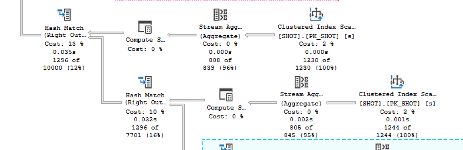
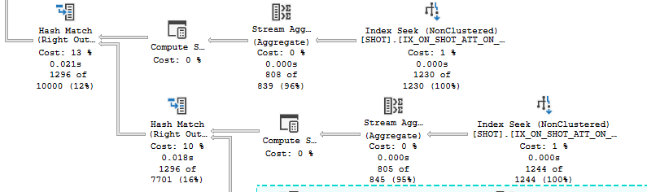

Wij hebben een view MATCHES_INFO.

Die haalt o.a. het aantal overtredingen, de schoten op goal en corners op.

Bij de schoten worden ze gesplitst of ze wel/niet op goal zijn, dat gebeurt met de simpele check die hieronder staat.

```sql
SELECT COUNT(*) FROM SHOT s WHERE m.MATCH_ID = s.MATCH_ID AND ON_GOAL = 1
SELECT COUNT(*) FROM SHOT s WHERE m.MATCH_ID = s.MATCH_ID AND ON_GOAL = 0
```

Wanneer naar de execution plan wordt gekeken is te zien dat er twee index scans worden gedaan op SHOT tabel, dit kan voor vertragingen zorgen wanneer er veel shots zijn (wat zeker het geval is bij schoten).

Dit probleem is op te lossen door een index te zetten op ON_GOAL (of query herschrijven).



De index zorgt wel voor meer performance kosten bij insert en delete (en update), bij deze database worden in het algemeen alleen schoten toegevoegd en uitgelezen.

In de database zullen niet al te veel schoten in één keer worden toegevoegd, dus zal er waarschijnlijk weinig problemen komen door een index.

De index:

```sql
CREATE NONCLUSTERED INDEX IX_ON_SHOT_ATT_ON_GOAL ON SHOT (ON_GOAL)
```

Het nieuwe queryplan:


In het nieuwe queryplan is te zien dat het nu index seeks zijn. Ze hebben ook een stuk lagere kosten.

Totally worth it.