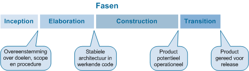

# ***Disclaimer*** | De lay-out van de PDF-versie voor dit document kan verschillen met de markdown versie, voor een accurate weergave zie markdown bestand in [bitbucket](https://isebitbucket.aimsites.nl/projects/S22122A4/repos/football-league-manager/browse/docs).

# Plan van aanpak - Football league manager

**Projectleden:**
- Joram Buitenhuis (653253)
- Tim Meuwsen (652989)
- Oktay Soyturk (635692)
- Thom Kraaijvanger (652413)
- Elmar Wiese (654870)
- Junjie Juan (637823)

**Projectgroep**: A4

**Klas**: ITA-ISE-A-f

**Datum**: 21-04-2022

**Versienummer**: 1.3

**Organisatie**: NUTMEG

**Opdrachtgever**: Michel Koolwaaij

---

# Inhoudsopgave

- [1. Inleiding](#1-inleiding)
- [2. Achtergrond van het project](#2-achtergrond-van-het-project)
- [3. Doelstelling, opdracht en op te leveren resultaten voor het bedrijf](#3-doelstelling-opdracht-en-op-te-leveren-resultaten-voor-het-bedrijf)
	- [3.1 Probleem](#31-probleem)
	- [3.2 Doelstelling](#32-doelstelling)
	- [3.3 Opdracht](#33-opdracht)
	- [3.4 Resultaat](#34-resultaat)
- [4. Projectgrenzen](#4-projectgrenzen)
- [5. Randvoorwaarden](#5-randvoorwaarden)
- [6. Op te leveren producten en kwaliteitseisen](#6-op-te-leveren-producten-en-kwaliteitseisen)
- [7. Ontwikkelmethoden](#7-ontwikkelmethoden)
- [8. Projectorganisatie en communicatie](#8-projectorganisatie-en-communicatie)
	- [8.1 Begeleiders](#81-begeleiders)
	- [8.2 Opdrachtgever](#82-opdrachtgever)
	- [8.3 Rolverdeling](#83-rolverdeling)
	- [8.4 Afspraken](#84-afspraken)
- [9. Planning](#9-planning)
	- [9.1 Globale planning](#91-globale-planning)
	- [9.2 Inleverdata](#92-inleverdata)
- [10. Risk List](#10-risk-list)
- [Literatuurlijst](#literatuurlijst)
- [Bijlagen](#bijlagen)
	- [Bijlage I - Rollenbeschrijvingen](#bijlage-i---rollenbeschrijvingen)
		- [Bijlage I - Rollenbeschrijvingen - Informatieanalist](#bijlage-i---rollenbeschrijvingen---informatieanalist)
		- [Bijlage I - Rollenbeschrijvingen - Use case designer](#bijlage-i---rollenbeschrijvingen---use-case-designer)
		- [Bijlage I - Rollenbeschrijvingen - Software architect](#bijlage-i---rollenbeschrijvingen---software-architect)
		- [Bijlage I - Rollenbeschrijvingen - Programmeur](#bijlage-i---rollenbeschrijvingen---programmeur)
		- [Bijlage I - Rollenbeschrijvingen - Tester](#bijlage-i---rollenbeschrijvingen---tester)

# 1. Inleiding

Het bedrijf NUTMEG heeft ons de opdracht gegeven de back-end voor het informatiesysteem "Football League Manager" te ontwikkelen. Met dit systeem kunnen gebruikers informatie van voetbalwedstrijden toevoegen en bestaande informatie uitlezen.

Binnen dit document zal eerst de concrete opdracht worden toegelicht. Vervolgens zal er in worden gegaan op de doelstelling van de opdracht en welke resultaten er opgeleverd gaan worden. Ook worden projectgrenzen en randvoorwaarden gesteld om de verantwoordelijkheid van het ontwikkelteam duidelijk te maken. Voor het waarborgen van de kwaliteit van het gehele product zijn ook kwaliteitseisen benoemd.

Verder wordt de ontwikkelmethode die het ontwikkelteam gaat gebruiken (RUP) toegelicht, evenals hoe deelnemers en betrokken partijen tijdens het project communiceren. Aan het einde van het document is een planning te vinden, met daarbij een opsomming van mogelijke risico's die het verloop van het project kunnen verstoren.

Bij elk van deze risico's zijn haalbare maatregelen ten hoeven van het voortzetten van het project vastgelegd om afwijkingen van de planning en doelstelling van het project tot een minimum te beperken.

# 2. Achtergrond van het project

Projectgroep A4 van de hogeschool Arnhem Nijmegen is in opdracht om een informatiesysteem te ontwikkelen en zijn verantwoordelijk voor het gehele project. Het team bestaat uit IT’ers die gespecialiseerd zijn in Data Modulering, Database Design en Database-implementatie. 

Dit project wordt uitgevoerd voor het bedrijf NUTMEG met als opdrachtgever Michel Koolwaaij. NUTMEG is een organisatie die sportdata verzamelt en verkoopt aan sportclubs. Data-analisten binnen die sportclubs kunnen die data dan analyseren.

Dit project is een vervolg van eerdere projecten. Ze hebben klanten in verschillende sporten als atletiek en zwemmen, maar willen nu ook data gaan aanbieden voor voetbalclubs. Hiervoor moet een database opgesteld worden met belangrijke data over voetbalcompetities en eventueel knock-out toernooien.
 
De belanghebbende partijen van het project zijn de klanten van NUTMEG, want ze krijgen hierdoor de mogelijkheid om data over de club te analyseren. Dit heeft positieve invloed op beide partijen, want NUTMEG kan hierdoor geld verdienen en klanten (data-analisten) kunnen hierdoor de club analyseren.

# 3. Doelstelling, opdracht en op te leveren resultaten voor het bedrijf

## 3.1 Probleem

NUTMEG wil voetbaldata gaan verkopen aan voetbalclubs. Hiervoor moet de database inclusief bijpassende API voor het opvragen van data nog opgesteld worden.

## 3.2 Doelstelling

De doelstelling van het bedrijf NUTMEG is om zo veel mogelijk data over verschillende sport branches te verzamelen om klanten te voorzien van analytische informatie. Ze willen dit project realiseren om een groter doelgroep te bereiken, zodat ze uiteindelijk ook meer omzet kunnen maken. NUTMEG zal hierdoor data-analisten bereiken die geïnteresseerd zijn in voetbaldata, waardoor ze ook steeds dichter bij het grote doel komen.

## 3.3 Opdracht

Projectgroep A4 gaat hier een bijdrage aan leveren door een database te bouwen die data van voetbalwedstrijden gaat opslaan. Hier gaat alleen een back-end voor ontwikkeld worden en geen front-end. Daarnaast ontwikkelen we de database alleen voor competitiewedstrijden en geen knock-out toernooien. De data dat opgeslagen gaat worden is te vinden in: opzet_databehoeften.md.

De database zal ontwikkeld worden voor NUTMEG in MSSQL en vervolgens beschikbaar gesteld worden aan data-analisten vanuit MongoDB (staging area). NUTMEG krijgt volledige toegang en kan direct schrijven en lezen op de MSSQL Serverdatabase. Data-analisten daarentegen kunnen alleen data lezen vanuit MongoDB.

## 3.4 Resultaat

- Plan van Aanpak;
- Functioneel ontwerp;
- Technisch ontwerp;
- Code;
- Testplan;
- Testrapport.

# 4. Projectgrenzen

**Start- en einddatum:**

De periode waarin we werken aan het project is van 11 april 2022 tot en met 9 juni 2022. 
Tijdens deze feestdagen wordt er niet gewerkt aan het project:
- 15 april 2022, Goede Vrijdag;
- 18 april 2022, 2e Paasdag;
- 27 april 2022, Koningsdag;
- 2 mei tot en met 6 mei 2022, meivakantie.
 
**Wat wel:**

- We leveren een MSSQL database die ontwikkeld is om voetbaldata op te slaan;
- We zorgen ervoor dat de data overgezet kan worden naar MongoDB (staging area);
- We nemen knock-out toernooien mee in ons datamodel, maar implementeren deze niet;
- De opdrachtgever kan requirements tijdens de start van de laatste iteratie binnen de constructie fase wijzigen.
 
**Wat niet:**

- We implementeren geen knock-out toernooi, maar nemen dit wel mee in ons datamodel;
- We leveren geen front-end applicatie;
- De opdrachtgever kan tijdens de transition fase geen nieuwe requirements of functionaliteiten meer geven.
 
**Deze hebben prioriteit:**

- Groepsbeoordeling tussentijds;
- Verantwoording projectbijdrage tussentijds;
- Groepsbeoordeling aan het eind;
- Verantwoording projectbijdrage aan het eind.

# 5. Randvoorwaarden

In dit hoofdstuk worden de randvoorwaarden beschreven, hierin staat wat er gedurende het project geregeld moet worden om het project mogelijk te maken.

**Voorwaarden:**

- Michel Koolwaaij (NUTMEG) maakt Jira toegankelijk voor het team om taken te plannen;
- Michel Koolwaaij (NUTMEG) maakt BitBucket toegankelijk voor het team om code te managen;
- Michel Koolwaaij (NUTMEG) levert beschikbare ruimtes met stroom en internet;
- De opdrachtgever (Michel Koolwaaij) is minimaal één keer per week beschikbaar op locatie;
- De procesbegeleider (Chris Scholten) is minimaal één keer per week beschikbaar op locatie;
- De professional skills docent (Nils Bijleveld) is minimaal één keer per week beschikbaar op locatie.

# 6. Op te leveren producten en kwaliteitseisen

In dit hoofdstuk worden de op te leveren producten en de bijbehorende kwaliteitseisen besproken.

Algemene eisen aan producten zijn gespecificeerd in de Definition of Done (DoD). In de kolom 'Product Kwaliteitseisen' zijn product specifieke eisen opgesteld.

De Definition of Done (DoD) wordt tijdens de elaboratie fase uitgewerkt, in een apart document.

De volgende tabel beschrijft:

- De op te leveren producten;
- De kwaliteitseisen waaraan de producten moeten voldoen; zodra het product alle kwaliteitseisen bevat, is het product kwalitatief voldoende;
- Wat het team moet uitvoeren om tot een succesvol product te komen;
- Hoe het team ervoor zorgt dat kwaliteitseisen behaald worden.

| Product         | Productkwaliteitseisen  (SMART)                                                                                                                                                                                                                                                                                                                                                                                                                                                                                                                                                                                                                                                                                                                                    | Benodigde activiteiten om te komen tot het product                                                                                                                                                                                            | Proceskwaliteitseisen  (5XW 1xH)                                                                                                                                                                                                                                                                                                                                                                                                                                                                                                                                |   |
|-----------------|--------------------------------------------------------------------------------------------------------------------------------------------------------------------------------------------------------------------------------------------------------------------------------------------------------------------------------------------------------------------------------------------------------------------------------------------------------------------------------------------------------------------------------------------------------------------------------------------------------------------------------------------------------------------------------------------------------------------------------------------------------------------|-----------------------------------------------------------------------------------------------------------------------------------------------------------------------------------------------------------------------------------------------|-----------------------------------------------------------------------------------------------------------------------------------------------------------------------------------------------------------------------------------------------------------------------------------------------------------------------------------------------------------------------------------------------------------------------------------------------------------------------------------------------------------------------------------------------------------------|---|
| FO              | Bevat een korte samenvatting van de op te leveren functionaliteit. FO is up-to-date met de huidige implementatie. De functionele requirements zijn uitgewerkt in de vorm van usecases. Bevat een CDM (Conceptual Data Model). Per usecase dient het volgende te zijn beschreven: Primaire actor en stakeholders. Brief description (brief format). Preconditie (concreet booleaans m.b.t. het conceptual data model). Postconditie (concreet booleaans m.b.t. het conceptual data model). Happy flow en optionele alternative flows. Opgestelde use cases voldoen aan eisen binnen "CRUD Use Cases.pdf" CDM voldoet aan eisen binnen "ERM opstellen.pdf" (HAN, I-OOSE OOAD 21/22). Eerste versie FO is af aan het einde van de eerste week van de Elaboratie-fase. | Requirements uitvragen. Functionele requirements uitwerken in use cases. Niet-functionele requirements uitwerken. Use cases uitschrijven in brief-format.  Bij oppakken van een brief-format use case, deze fully dressed uitwerken.          | Bij het opleveren van het document wordt het hele document door alle teamleden gelezen. Hierdoor kan er genoeg feedback worden gegeven op het product. Het hele document moet worden gelezen zodat ook samenhang van het document gecontroleerd kan worden. Tijdens het geven van feedback wordt gekeken naar de punten opgesteld in de Definition of Done en de productkwaliteitseisen in deze tabel.                                                                                                                                                          |   |
| TO              | Bevat een PDM (Physical Domain Model). Bevat een databaseontwerp. Bevat beargumentatie van de ontwerpkeuzes weergegeven in de bovengenoemde diagrammen. PDM voldoet aan opgestelde eisen binnen document "PDM opstellen.pdf" (HAN, I-ISE DMDD/2 2122). Eerste versie TO is af aan het einde van de tweede week van de Elaboratie-fase.                                                                                                                                                                                                                                                                                                                                                                                                                             | Database design opstellen. PDM opstellen.                                                                                                                                                                                                     | Bij het opleveren van het document wordt het hele document door alle teamleden gelezen. Hierdoor kan er genoeg feedback worden gegeven op het product. Het hele document moet worden gelezen zodat ook samenhang van het document gecontroleerd kan worden. Tijdens het geven van feedback wordt gekeken naar de punten opgesteld in de Definition of Done en de productkwaliteitseisen in deze tabel.                                                                                                                                                          |   |
| Code            | Voldoet aan code conventies wanneer de code uit een branch gemerged wordt met de dev branch. Deze conventies zijn te vinden in de Definition of Done.                                                                                                                                                                                                                                                                                                                                                                                                                                                                                                                                                                                                              | Eerst wordt de code geschreven. Wanneer de code is geschreven, worden er unittests gemaakt. Constraints, triggers, gebruiker permissies en stored procedures zijn voor 60% getest (voor de coverage wordt de coverage van tSQLt aangehouden). | Wanneer iemand een stuk code wil plaatsen op BitBucket, wordt dit gedaan door een pull request (PR) aan te maken. Deze PR wordt gecontroleerd door minimaal 1 ander teamlid. Dit gebeurt binnen maximaal 1 werkdag. Als dat teamlid een (grote) bug vindt in de code of vindt dat de code niet voldoet aan de DoD, wordt de PR tegengehouden en moet de code herzien worden door de auteur van de PR. Wanneer er geen bugs (meer) in de code zitten, mag de code op BitBucket gezet worden. Op deze manier voorkomt het team dat er bugs worden geïntroduceerd. |   |
| Plan van Aanpak | Een dag voor het opleveren van het PvA, is het PvA geschreven volgens de toelichting op het plan van aanpak (Praktijkbureau AIM, Hogeschool Arnhem Nijmegen). Definitieve versie van PvA is af aan het einde van de Elaboratie-fase.                                                                                                                                                                                                                                                                                                                                                                                                                                                                                                                               | Introductiegesprek met opdrachtgever. In kaart brengen van de requirements. Afspraken maken over ontwikkelmethode. Compleetheid van PvA bespreken met inhoudelijk begeleider en professional skills begeleider.                               | Vóór de elaboratie fase moet het PvA gereviewd worden door alle teamleden. Het PvA moet zijn ingeleverd voor de opgegeven datum zodat de procesbegeleider het PvA kan beoordelen. Als de procesbegeleider feedback heeft op het ingeleverde PvA, wordt deze feedback binnen 1 werkweek verwerkt.                                                                                                                                                                                                                                                                |   |
| Testrapport     | Wanneer het document wordt opgeleverd, toont het document het slagingspercentage van de geteste code. Ook beschrijft het document redenen voor eventuele gefaalde tests. Testrapport is af aan het einde van de Transitie-fase.                                                                                                                                                                                                                                                                                                                                                                                                                                                                                                                                    | Er zijn testdoelen opgesteld. Resultaten van tests zijn genoteerd. De redenen voor gefaalde tests zijn uitgeschreven.                                                                                                                         | Er wordt gebruik gemaakt van tSQLt om de applicatie te testen, de resultaten hiervan worden verwerkt in het testrapport.                                                                                                                                                                                                                                                                                                                                                                                                                                        |   |
| Testplan        | Wanneer het document wordt opgeleverd, geeft het document de stappen weer om de gewenste code coverage te behalen. Ook geeft het document het doel van alle tests weer en geeft het document weer hoe er getest wordt. Testplan is af aan het einde van de Transitie-fase.                                                                                                                                                                                                                                                                                                                                                                                                                                                                                         | Methoden die gebruikt worden om te testen zijn uitgeschreven. Gewenste input en resultaten zijn opgesteld.                                                                                                                                     | Het testplan wordt door het hele team gereviewed. Feedback uit deze reviews wordt binnen 1 werkdag verwerkt.                                                                                                                                                                                                                                                                                                                                                                                                                                                    |   |
# 7. Ontwikkelmethoden

Tijdens dit project zal de RUP-ontwikkelmethode toegepast worden, deze methode wordt namelijk vanuit de HAN voorgeschreven.

Vanaf de Elaboratie-fase zullen elementen vanuit SCRUM overgenomen worden, bijvoorbeeld de Daily Stand-up en het gebruik van een SCRUM-board.

We hebben ervoor gekozen om de Elaboratie-fase op te delen in twee fases. Tijdens de eerste week zullen we veel gaan timeboxen om zo kennis te maken met technieken die nieuw voor ons zijn, zoals staging in MongoDB. In de tweede week zullen we een korte SCRUM-sprint houden om doelgericht onderzoek te kunnen doen.

Tijdens de Construction-fase zal iedere iteratie een SCRUM-sprint gehouden worden (elke sprint zal ongeveer bestaan uit 1,5 week)

Tevens moet het team ook persoonlijke ontwikkeling gedurende het project bijhouden. Dit vermindert de tijd die uiteindelijk aan het product besteed kan worden. Het team heeft ingeschat één middag per week kwijt te zijn aan het bijhouden van de persoonlijke ontwikkeling.

# 8. Projectorganisatie en communicatie

## 8.1 Begeleiders

Tijdens het project is de procesbegeleider twee keer per week beschikbaar voor een meeting en is hij contacteerbaar via teams.

| Persoon           | Rol               | Contact                                               | Beschikbaarheid                  |
|-------------------|-------------------|-------------------------------------------------------|----------------------------------|
| Nils Bijleveld    | Professional Skills Docent  | [nils.bijleveld@han.nl](mailto:nils.bijleveld@han.nl) | Fysiek: Do                       |
| Chris Scholten    | Procesbegeleider | [chris.scholten@han.nl](mailto:chris.scholten@han.nl) | Fysiek: Di/Do Digitaal: Ma/Wo/Vr |

## 8.2 Opdrachtgever

| Persoon          | Rol              | Contact                                                                       | Beschikbaarheid    |
|------------------|------------------|-------------------------------------------------------------------------------|--------------------|
| Michel Koolwaaij | Opdrachtgever    | Bericht in teams of [michel.koolwaaij@han.nl](mailto:michel.koolwaaij@han.nl) | Dinsdag en Vrijdag |

## 8.3 Rolverdeling

| Persoon           | Rol                | Wat                                                                                                                            | Contact                                                                 |
|-------------------|--------------------|--------------------------------------------------------------------------------------------------------------------------------|-------------------------------------------------------------------------|
| Elmar Wiese        | Software Architect | Zie de bijlage [Bijlage I - Rollenbeschrijvingen - Software architect](#bijlage-i---rollenbeschrijvingen---software-architect) | [ej.wiese@student.han.nl](mailto:ej.wiese@student.han.nl)               |
| Joram Buitenhuis  | Programmeur        | Zie de bijlage [Bijlage I - Rollenbeschrijvingen - Programmeur](#bijlage-i---rollenbeschrijvingen---programmeur)               | [jej.buitenhuis@student.han.nl](mailto:jej.buitenhuis@studnet.han.nl)   |
| Junjie Juan       | Use case designer  | Zie de bijlage [Bijlage I - Rollenbeschrijvingen - Use case designer](#bijlage-i---rollenbeschrijvingen---use-case-designer)   | [jj.juan@student.han.nl](mailto:jj.juan@student.han.nl)                 |
| Oktay Soytürk     | Tester             | Zie de bijlage [Bijlage I - Rollenbeschrijvingen - Tester](#bijlagei---rollenbeschrijvingen---tester)                          | [o.soyturk@student.han.nl](mailto:o.soyturk@student.han.nl)               |
| Thom Kraaijvanger | Informatieanalist  | Zie de bijlage [Bijlage I - Rollenbeschrijvingen - Informatieanalist](#bijlage-i---rollenbeschrijvingen---informatieanalist)   | [t.kraaijvanger1@student.han.nl](mailto:t.kraaijvanger1@student.han.nl) |
| Tim Meuwsen       | Programmeur        | Zie de bijlage [Bijlage I - Rollenbeschrijvingen - Programmeur](#bijlage-i---rollenbeschrijvingen---programmeur)               | [t.meuwsen@student.han.nl](mailto:t.meuwsen@student.han.nl)             |

## 8.4 Afspraken

Tijdens het project zijn er meerdere afspraken gemaakt binnen de groep.

- De groep werkt iedere maandag t/m vrijdag van 9:00 t/m 17:00.
- Bij afwezigheid geeft de des betreffende persoon het op zijn minst een week van te voren aan.
- Bij afwezigheid door ziekte moet de persoon dit voor 9 uur aangeven.
	- Als de persoon thuis is vanwege ziekte wordt er via teams gewerkt, mits hij hier toe in staat is.
- Op einde van de dag moet alles gepushed zijn naar de bij behorende branch.
- Elke dag is er een pauze van 12:00 tot 13:00.
- Bij conflicten worden de personen apart gehouden en uitgepraat totdat het conflict opgelost is.
- Er wordt iedere werkdag, tijdens de elaboration- en construction fase, een daily stand-up gehouden om 9:15 en duurt maximaal 15 minuten.

# 9. Planning

Het ISE-project vindt plaats op 11-04-2022 t/m 09-06-2022. Binnen deze periode staat er een vakantie van 02-05-2022 t/m 08-05-2022 gepland. Hierdoor is de totale duur van het project acht weken. De ontwikkelmethode waar gebruik van wordt gemaakt is RUP.

## 9.1 Globale planning

| Fase        | Start | Eind  |
|-------------|-------|-------|
| Inception   | OW-0  | OW-1  |
| Elaboration | OW-2  | OW-4  |
| Construction| OW-5  | OW-8  |
| Transition  | OW-9  | OW-10 |

## 9.2 Inleverdata

| In te leveren                               | Datum      | Tijd  |
|---------------------------------------------|------------|-------|
| Individuele projectvoorbereiding            | 15-04-2022 | 16:00 |
| Groepsbeoordeling tussentijds               | 13-05-2022 | 16:00 |
| Verantwoording projectbijdrage tussentijds  | 13-05-2022 | 16:00 |
| Groepsbeoordeling aan het eind              | 09-06-2022 | 16:00 |
| Verantwoording projectbijdrage aan het eind | 09-06-2022 | 16:00 |

# 10. Risk List

| Risico                                  | Tegenmaatregel | Uitwijkstrategie |
|-----------------------------------------|----------------|------------------|
| Mongo Database opzetten                 | PoC voor docker omgeving mac  |  De mac-gebruikers moeten windows of linux runnen. Anders andere laptop regelen. |
| Mongo database koppelen aan MSSQL server | PoC maken voor de koppeling  | Staging area veranderen naar spring boot. |

# Literatuurlijst

- *Naslagsite 2011*. (2011). RUP Op Maat. Geraadpleegd op 12 april 2022, van [http://rupopmaat.nl/naslagsite2011/](http://rupopmaat.nl/naslagsite2011/)
- *Hogeschool Arnhem Nijmegen*. (2019, 2 september). AIM controlekaart. Onderwijs Online. Geraadpleegd op 12 april 2022, van [https://onderwijsonline.han.nl/elearning/content/oNkklGNj](https://onderwijsonline.han.nl/elearning/content/oNkklGNj)
- *HAN*. Organisatie - Project Cheatsheet - Studiehandleiding ISE-project 2021-2022. OnderwijsOnline. Geraadpleegd op 12 april 2022, van [https://han.onderwijsonline.nl/elearning/lesson/Xyrrjkjy](https://han.onderwijsonline.nl/elearning/lesson/Xyrrjkjy)
- *Praktijkbureau AIM, Hogeschool Arnhem Nijmegen*. (2020, september).  Hoe kom je tot een goed plan van aanpak en wat moet erin staan? [Handleiding]. Onderwijs Online. Geraadpleegd op 12 april 2022,  [https://onderwijsonline.han.nl/elearning/lessonfile/XD5kJg1N/eyJpdiI6InNFQW5lNHRzRDh5SWpVeWg4K1pPWkE9PSIsInZhbHVlIjoiMEdEalZsQmJyajR2RmJFRlR4dTVWcy9VWGE4cmdGenJGWTFYQTZQajZxbTdjNFVQM1JsQTBneWYxMjZKMWs1MCIsIm1hYyI6ImRiYzEyNTkzMWZlMjVjZjRiNDBkODc1ODk4MjZhZDNhMjliYTg1ZGFkMTU3ZjhlMzJhZjVlZTllM2M5YzAwZWUifQ==](https://onderwijsonline.han.nl/elearning/lessonfile/XD5kJg1N/eyJpdiI6InNFQW5lNHRzRDh5SWpVeWg4K1pPWkE9PSIsInZhbHVlIjoiMEdEalZsQmJyajR2RmJFRlR4dTVWcy9VWGE4cmdGenJGWTFYQTZQajZxbTdjNFVQM1JsQTBneWYxMjZKMWs1MCIsIm1hYyI6ImRiYzEyNTkzMWZlMjVjZjRiNDBkODc1ODk4MjZhZDNhMjliYTg1ZGFkMTU3ZjhlMzJhZjVlZTllM2M5YzAwZWUifQ==)
- *HAN*. I-OOSE OOAD 21/22. OnderwijsOnline. Geraadpleegd op 21 april 2022, van https://han.onderwijsonline.nl/elearning/lesson/Vyb8QLRq
- *HAN*. I-ISE DMDD/2 2122. (Arnhem). OnderwijsOnline. Geraadpleegd op 21 april 2022, van https://han.onderwijsonline.nl/elearning/lesson/XyrrXeQy
# Bijlagen

## Bijlage I - Rollenbeschrijvingen

### Bijlage I - Rollenbeschrijvingen - Informatieanalist

De rol van Informatieanalist is verantwoordelijk voor het helder krijgen van requirements en het modelleren van Use Cases, waardoor hij de functionaliteit en grenzen van het te bouwen systeem bepaalt en bewaakt (Naslagsite 2011, 2011).

### Bijlage I - Rollenbeschrijvingen - Use case designer

De rol van Use Case Designer is verantwoordelijk voor het specificeren van Use Cases, inclusief schermontwerpen en schermverloop (Naslagsite 2011, 2011).

### Bijlage I - Rollenbeschrijvingen - Software architect

De rol van Softwarearchitect is verantwoordelijk voor het maken, beargumenteren en documenteren van de technische keuzes in het project, die de architectuur en dus de technische grenzen en mogelijkheden voor de te bouwen applicatie bepalen. Tevens draagt de Softwarearchitect de verantwoordelijkheid voor het communiceren van de architectuur en ziet hij erop toe dat deze ook wordt geïmplementeerd (Naslagsite 2011, 2011).

### Bijlage I - Rollenbeschrijvingen - Programmeur

De rol van Programmeur is verantwoordelijk voor het technisch ontwerpen, ontwikkelen, documenteren en (het automatiseren van) testen van software (Naslagsite 2011, 2011).

### Bijlage I - Rollenbeschrijvingen - Tester

De rol van Tester is verantwoordelijk voor het specificeren van test cases en het vastleggen daarvan in een Testontwerp. Daarnaast draagt hij zorg voor het uitvoeren ervan (Naslagsite 2011, 2011).

