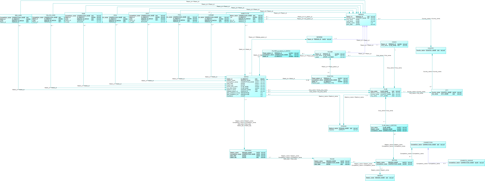

# Technisch ontwerp

# Non-Functional Requirements

## Performance and scalability

- Data uitlezen wordt gedaan via een staging area met mongoDB, hierdoor wordt de load op de MSSQL database verlaagd

## Portability and compatibility

- MSSQL is vereist voor het *opzetten* van de database
- MongoDB is vereist voor het *uitlezen* van de database

## Reliability, availability, maintainability

- De data wordt opgeslagen in MSSQL en periodiek overgezet naar MongoDB staging area

## Security

- Administrators van NUTMEG kunnen de MSSQL database volledig beheren
- Data-analisten van klanten kunnen de database alleen uitlezen via de staging area

## Localization

- De data wordt in het Nederlands opgeslagen
- Tabelnamen staan in het Engels

## Usability

- Data-analisten kunnen via de MongoDB shell data uitlezen van de staging area

# PDM



# Beschrijving Tabellen en Kolommen

## Tabel: PERSON

Deze tabel bevat alle informatie van personen in de database.

|*Kolom*|*Omschrijving*|
|-------|--------------|
| Person_id| Unieke persoonsnummer |
| Country_name| Naam van nationaliteit|
|First_name | Voornaam van persoon|
|Last_name| Achternaam van persoon|
|Middle_name| Tussenvoegsel van persoon|
|Birth_date| Wanneer de persoon is geboren|

## Tabel: REFEREE

Deze tabel bevat alle personen die ook scheidsrechters zijn.

|*Kolom*|*Omschrijving*|
|-------|--------------|
|Person_id| Unieke persoonsnummer|

## Tabel: COACH

Deze tabel bevat alle personen die ook coaches zijn.

|*Kolom*|*Omschrijving*|
|-------|--------------|
|Person_id| Unieke persoonsnummer|
|Club_name|De naam van de club waar deze coach werkt|

## Tabel: PLAYER

Deze tabel bevat alle personen die ook spelers zijn.

|*Kolom*|*Omschrijving*|
|-------|--------------|
|Person_id | Unieke persoonsnummer|
|Club_name|Naam van de club waarin deze speler speelt|
|Jersey|Rugnummer van deze speler|

## Tabel: COUNTRY

Deze tabel bevat alle landen.

|*Kolom*|*Omschrijving*|
|-------|--------------|
|Country_name| Naam van het desbetrefende land|

## Tabel: CITY

Deze tabel bevat alle steden.

|*Kolom*|*Omschrijving*|
|-------|--------------|
|Country_name|Het land waarin deze stad ligt|
|City_name|De naam van deze stad|

## Tabel: STADIUM

Deze tabel bevat alle stadions

|*Kolom*|*Omschrijving*|
|-------|--------------|
|Stadium_name|Naam van dit stadion|
|Capacity|Het max aantal personen die in dit stadion kunnen|

## Tabel: CLUB

Deze tabel bevat alle clubs die wedstrijden kunnen spelen.

|*Kolom*|*Omschrijving*|
|-------|--------------|
|Club_name|Unieke naam van deze club|
|Stadium_name|Naam van het stadion van deze club|
|Country_name|Land waarin deze club ligt|
|City_name| Stad waarin deze club ligt|

## Tabel: SEASON

Voor uitleg zie FO

|*Kolom*|*Omschrijving*|
|-------|--------------|
|Season_name|Unieke naam van een bepaald speel seizoen|

## Tabel: DOMESTIC_LEAGUE 

Voor uitleg zie FO

|*Kolom*|*Omschrijving*|
|-------|--------------|
|Competition_name|Unieke naam van deze competitie|

## Tabel: EDITION

Voor uitleg zie FO

|*Kolom*|*Omschrijving*|
|-------|--------------|
|Season_name|Naam van het seizoen van deze editie|
|Competition_name|Naam van de competitie die deze editie heeft|

## Tabel: ROUND

Voor uitleg zie FO

|*Kolom*|*Omschrijving*|
|-------|--------------|
|Season_name|Naam van het seizoen waarin deze ronde wordt gespeeld|
|Competition_name|Naam van de competitie waarin deze ronde wordt gespeeld|
|Start_date|Startdatum van deze specifieke ronde|

## Tabel: CLUB_plays_in_EDITION

In deze tabel staat welke clubs participeren in een specifieke editie.

|*Kolom*|*Omschrijving*|
|-------|--------------|
|Season_name|Naam van het seizoen waarin een club speelt|
|Competition_name|Naam van de competitie waarin een club speelt|
|Club_name|Naam van de club die in een editie speelt|

## Tabel: MATCHDAY

Voor uitleg zie FO

|*Kolom*|*Omschrijving*|
|-------|--------------|
|Season_name|Naam van het seizoen waarin deze speeldag wordt gespeeld|
|Competition_name|Naam van de competitie waarin deze speeldag wordt gespeeld|
|Start_date|Startdatum van de ronde waarin deze speeldag wordt gespeeld|
|Match_day|Een unieke speeldag datum|

## Tabel: MATCH

Voor uitleg zie FO

|*Kolom*|*Omschrijving*|
|-------|--------------|
|Match_id|Unieke gegenereerde id waarde van een wedstrijd|
|Season_name|Naam van het seizoen waarin deze wedstrijd wordt gespeeld|
|Competition_name|Naam van de competitie waarin deze competitie wordt gespeeld|
|Start_date|Startdatum van de ronde waarin deze wedstrijd wordt gespeeld|
|Match_day|Datum van de westrijd|
|Home_club_name|Naam van de thuisclub die deze wedstrijd speelt|
|Out_club_name|Naam van de uitclub die deze wedstrijd speelt|
|Referee_person_id|Id verwijzing naar de scheids van deze wedstrijd|
|Ball_possession_home|Hoeveel de thuisclub de bal in bezit heeft in procenten|
|Ball_possession_out|Hoeveel de uitclub de bal in bezit heeft in procenten|
|Spectators|Aantal toeschouwers die naar deze wedstrijd zijn geweest|

## Tabel: POSITION

Voor uitleg zie FO

|*Kolom*|*Omschrijving*|
|-------|--------------|
|Player_person_id|Unieke id van een persoon dat speler is|
|Match_id|Unieke id van de wedstrijd|
|Position_type|Geeft aan op welke positie een speler staat op het veld bij de wedstrijd (aanvaller, verdediger etc.)|

## Tabel: PLAYER_as_reserve_in_MATCH

In dit tabel staan alle spelers die in de reserve staan bij een bepaalde wedstrijd.

|*Kolom*|*Omschrijving*|
|-------|--------------|
|Player_person_id|Unieke id van een persoon dat speler is|
|Match_id|Unieke id van de wedstrijd|

## Tabel: SUBSTITUTE

Voor uitleg zie FO

|*Kolom*|*Omschrijving*|
|-------|--------------|
|Match_id|Unieke id van de wedstrijd waarin dit is gebeurt|
|Time|Geeft aan in welke minuut deze gebeurtenis is gebeurt|
|In_person_id|Unieke id van de persoon die nu op het veld gaat staan|
|Out_person_id|Unieke id van de persoon die nu uit het veld gaat|

## Tabel: CORNER

Voor uitleg zie FO

|*Kolom*|*Omschrijving*|
|-------|--------------|
|Match_id|Unieke id van de wedstrijd waarin dit is gebeurt|
|Time|Geeft aan in welke minuut deze gebeurtenis is gebeurt|
|Person_id|Id van de persoon die deze gebeurtenis veroorzaakt|

## Tabel: FOUL

Voor uitleg zie FO

|*Kolom*|*Omschrijving*|
|-------|--------------|
|Match_id|Unieke id van de wedstrijd waarin dit is gebeurt|
|Time|Geeft aan in welke minuut deze gebeurtenis is gebeurt|
|Person_id|Id van de persoon die deze gebeurtenis veroorzaakt|

## Tabel: SHOT

Voor uitleg zie FO

|*Kolom*|*Omschrijving*|
|-------|--------------|
|Match_id|Unieke id van de wedstrijd waarin dit is gebeurt|
|Time|Geeft aan in welke minuut deze gebeurtenis is gebeurt|
|Person_id|Id van de persoon die deze gebeurtenis veroorzaakt|
|On_goal|Hiermee wordt aangegeven of het schot naar het doel is geschoten|

## Tabel: GOAL

Voor uitleg zie FO

|*Kolom*|*Omschrijving*|
|-------|--------------|
|Match_id|Unieke id van de wedstrijd waarin dit is gebeurt|
|Time|Geeft aan in welke minuut deze gebeurtenis is gebeurt|
|Person_id|Id van de persoon die deze gebeurtenis veroorzaakt|

## Tabel: PASS

Voor uitleg zie FO

|*Kolom*|*Omschrijving*|
|-------|--------------|
|Match_id|Unieke id van de wedstrijd waarin dit is gebeurt|
|Time|Geeft aan in welke minuut deze gebeurtenis is gebeurt|
|Person_id|Id van de persoon die deze gebeurtenis veroorzaakt|
|Succes|Hiermee wordt aangegeven dat de paas is aangekomen|

## Tabel: YELLOW_CARD

Voor uitleg zie FO

|*Kolom*|*Omschrijving*|
|-------|--------------|
|Match_id|Unieke id van de wedstrijd waarin dit is gebeurt|
|Time|Geeft aan in welke minuut deze gebeurtenis is gebeurt|
|Person_id|Id van de persoon die deze gebeurtenis veroorzaakt|

## Tabel: RED_CARD

Voor uitleg zie FO

|*Kolom*|*Omschrijving*|
|-------|--------------|
|Match_id|Unieke id van de wedstrijd waarin dit is gebeurt|
|Time|Geeft aan in welke minuut deze gebeurtenis is gebeurt|
|Person_id|Id van de persoon die deze gebeurtenis veroorzaakt|

# Ontwerkpeuzes

## MATCH id

Door de afhankelijkheden van match zou de orignele primary key maarliefst 6 kolommen lang zijn. Event, position en Player_as_Reserve zouden daarnaast ook  afhankelijk zijn van match waardoor deze tabellen ook allemaal de 6 kolommen lange primary key zouden bevatten. Om deze reden is ervoor gekozen om match van een ID te voorzien.

## PERSON id

Om een persoon van een daadwerkelijk van een unieke identifier te voorzien moeten niet alleen de naam en de achternaam gebruikt worden, maar ook de geboortedatum, melfs met deze waarden is er echter nog een nihiele kans dat de waardne niet uniek zijn. Daarnaast wordt de primary key van Person in maar liefst 3 andere tabellen gebruikt. Om deze redenen is ervoor gekozen om Person een uniek ID te geven.

## 0..22 Position

Om een wedstrijd te starten moet er uiteraard 22 spelers op het veld staan, echter worden wedstrijden als vastgesteld en aangemaakt ver voordat de opstelling bekend zijn. Hierom hebben ervoor gekozen het ook mogelijk te 0 tot 22 spelers op te stellen. Met een trigger wordt gecheckt of er wel 22 spelers zijn opgesteld voordat de wedstrijd daadwerkelijk start.

# Constraints

## Primary key constraints

### Person

PI: Person ID

### Match

PI: Club_name + club_name + match_day + start_date + end_date + competition_name + season_name

### Club

PI: Club_name

### City

PI: City_name

### Country

PI: Country_name

### Competition

PI: Competition_name

### Season

PI: Season_name

### Round

PI: Start_date + end_date

### Matchday

PI: Match_day + start_date + end_date + competition_name + season_name

### Event

PI: Time + club_name + club_name + match_day + start_date + end_date + competition_name + season_name

## Integrity rules

### IR1 komt overeen met C1 en BR12

- Omschrijving: Er zijn maximaal 22 spelers aan een match verbonden (11 per club);
- Implementatie: Een trigger `TRG_CHECK_PLAYER_COUNT` op de tabel `POSITION`.

### IR2 komt overeen met C2 en BR18

<!-- TODO: Hoe doen we dit wanneer er b.v. een nieuwe club wordt aangemaakt, want dan beginnen ze met < 11 spelers... -->
- Omschrijving: Er zijn minimaal 11 spelers aan een club verbonden;
- Implementatie: Een trigger `TRG_MINIMUM_PLAYERS_IN_CLUB` op de tabel `PLAYER`.

### IR3 komt overeen met C3 en BR19

- Omschrijving: Een club heeft altijd precies 1 coach;
- Implementatie: Een trigger `TRG_ONE_COACH_PER_CLUB` op de tabel `COACH`.

### IR4 komt overeen met C4 en BR16

- Omschrijving: Er zijn maximaal 52 speelrondes per editie van een competitie;
- Implementatie: Een trigger `TRG_CHECK_MAXIMUM_ROUNDS_OF_EDITION` op de tabel `ROUND`.

### IR5 komt overeen met C5 en BR17

- Omschrijving: Een rugnummer van een speler moet hoger zijn dan 0 (mag niet 0 zijn) en mag niet hoger zijn dan 99 (mag wel 99 zijn);
- Implementatie: Een check-constraint `CHK_VALID_JERSEY` op de tabel `PLAYER`.

### IR6 komt overeen met C6 en BR4

- Omschrijving: De startdatum van een speelronde ligt binnen de start- en einddatum van het bijbehorende seizoen;
- Implementatie: Een check-constraint `CHK_VALID_ROUND_START_DATE` op de tabel `ROUND`. <!-- De startdatum is beschikbaar door de afhankelijkheid. Als dit wordt aangepast, moet de check een trigger worden -->

### IR7 komt overeen met C7 en BR5

- Omschrijving: De startdatum van een speeldag moet voor de startdatum van een opvolgende speelronde zijn, maar hetzelfde of na de startdatum van de gekoppelde speelronde;
- Implementatie: Een trigger `TRG_CHECK_VALID_MATCHDAY_START_DATE` op de tabel `MATCHDAY`.

### IR8 komt overeen met C8 en BR8

- Omschrijving: De spelers die aan een wedstrijd zijn gekoppeld moeten lid zijn van één van de twee clubs die aan de wedstrijd meedoen;
- Implementatie: Een trigger `TRG_CHECK_CORRECT_PLAYERS_IN_MATCH` op de tabel `POSITION` en `PLAYER_as_reserve_in_MATCH`.

### IR9 komt overeen met C9 en BR9

- Omschrijving: Een club mag alleen meedoen aan een wedstrijd als ze ook aan de bijbehorende editie meedoen;
- Implementatie: Een trigger `TRG_CHECK_CLUB_IN_EDITION` op de tabel `MATCH`.

### IR10 komt overeen met C10 en BR10

- Omschrijving: Alleen spelers en coaches mogen een rode of gele kaart krijgen;
- Implementatie: Een trigger `TRG_PERSON_IS_PLAYER_OR_COACH` op de tabellen `YELLOW_CARD` en `RED_CARD`.

### IR11 komt overeen met C11 en BR11

- Omschrijving: Alleen voor spelende spelers in een wedstrijd worden het aantal schoten, het aantal passes, de wissels, de overtredingen, de corners en of de persoon heeft gescoord bijgehouden;
- Implementatie: Een trigger `TRG_PERSON_IS_PLAYER` op de tabellen `PASS`, `GOAL`, `SHOT`, `FOUL`, `CORNER` en `SUBSTITUTE`.

### IR12 komt overeen met C12 en BR20

- Omschrijving: Een persoon mag niet jonger zijn dan 15 jaar;
- Implementatie: Een check-constraint `CHK_PERSON_HAS_VALID_AGE` op de tabel `PERSON`.

## IR13 komt overeen met C13 en BR21

- Omschrijving: Het aantal toeschouwers bij een wedstrijd mag niet groter zijn dan de capaciteit van het stadion waar de wedstrijd wordt gehouden;
- Implementatie: Een trigger `TRG_VALID_AMOUNT_OF_SPECTATORS` op de tabel `MATCH`.

## IR14 komt overeen met C14 en BR22

- Omschrijving: De minuut in een wedstrijd mag niet negatief zijn;
- Implementatie: Een check-constraint `CHK_VALID_MINUTE_IN_MATCH` op de tabellen `RED_CARD`, `YELLOW_CARD`, `PASS`, `GOAL`, `SHOT`, `FOUL`, `CORNER` en `SUBSTITUTE`.
Om een wedstrijd te starten moet er uiteraard 22 spelers op het veld staan, echter worden wedstrijden als vastgesteld en aangemaakt ver voordat de opstelling bekend zijn. Hierom hebben ervoor gekozen het ook mogelijk te 0 tot 22 spelers op te stellen. Met een trigger wordt gecheckt of er wel 22 spelers zijn opgesteld voordat de wedstrijd daadwerkelijk start.

## IR15 komt overeen met diagram en BR24

- Omschrijving: Een persoon moet een speler, coach of scheidsrechter zijn.
- Implementatie: Een trigger `TRG_PLAYER_MUST_BE_ONE_SUBTYPE` op de tabellen `PLAYER`, `COACH` en `REFEREE`.

# Toelichting Domeinen

|Domein				|Datatype		|Toelichting															|
|-------------------|---------------|-----------------------------------------------------------------------|
|PERSON_ID			|bigint			|Automatisch gegenereerd ID												|
|NAME				|varchar(128)	|																		|
|DATE				|Date			|																		|
|CLUB_NAME			|varchar(128)	|																		|
|CITY_NAME			|varchar(128)	|																		|
|COUNTRY_NAME		|varchar(128)	|																		|
|STADIUM_NAME		|varchar(60)	|																		|
|COMPETITON_NAME	|varchar(128)	|																		|
|CAPACITY			|bigint			|																		|
|PERCENTAGE			|numeric(5,2)	|(0-100)																|
|COUNT				|bigint			|																		|
|BOOLEAN			|bit			|																		|
|EVENTY_TYPE		|varchar(128)	|(Red card, Yellow card, Pass, Goal, Shot, Foul, Corner, Substitute)	|
|MINUTE IN MATCH	|numeric(6,3)	|																		|
|JERSEY_NUMBER		|numeric(2,0)	|(1-99)                                                    				|
|POSITION_TYPE		|varchar(128)	|(Aanvaller, Middenvelder, Verdediger, Keeper)							|
|SEASON_NAME		|char(5)		|Altijd twee getallen met een slash. (bijv.22/21)       				|

# Toelichting export MSSQL naar MongoDB

Voor het omzetten van data in MSSQL Server naar MongoDB wordt gebruik gemaakt van een Python script.

De reden voor het gebruik van Python is omdat het snel is om code mee te schrijven en de code leesbaar is voor iedereen in de projectgroep. (Ook al is niet iedereen vaardig in het schrijven van Python code).

Hieronder staat toegelicht hoe dit script in elkaar zit:

Het script begint met een timer van 15 seconden, de reden hiervoor is omdat MSSQL en MongoDB opgestart moeten zijn voordat ermee verbonden kan worden. Ook moet MSSQL een (groot) aantal create- en insert scripts uitvoeren, waar ook op gewacht moet worden.

Wanneer de verbindingen met de databases zijn gemaakt, wordt aan MSSQL opgevraagt welke tabellen en views er in de database staan. Vervolgens wordt alle data als JSON uit deze tabellen en views getrokken en wordt dit opgeslagen.

Zodra dit is gebeurd, wordt er over alle opgehaalde tabellen en views heen geloopt en worden deze als collections in MongoDB geplaatst.

## Input

```sql
SELECT TOP 10 ID, FIRST_NAME, EMAIL, GENDER, IP_ADDRESS, A_BIG_NUMBER FROM MOCK_DATA;
```

```
id          first_name                                         email                                              gender                                             ip_address           a_big_number
----------- -------------------------------------------------- -------------------------------------------------- -------------------------------------------------- -------------------- ------------
          1 Wells                                              wbraddick0@yellowbook.com                          Male                                               37.5.189.141                  172
          2 Phaidra                                            pdumbellow1@twitter.com                            Female                                             18.254.21.176                 567
          3 Taffy                                              tsherrett2@usnews.com                              Female                                             130.106.253.132               545
          4 Sinclare                                           sdomeney3@irs.gov                                  Male                                               233.160.141.121               106
          5 Park                                               pmacquire4@sogou.com                               Male                                               83.92.149.53                  409
          6 Pauly                                              polsen5@techcrunch.com                             Genderfluid                                        239.135.132.236                25
          7 Pavlov                                             pbygraves6@youtube.com                             Male                                               86.232.150.235                235
          8 Domingo                                            dmelland7@is.gd                                    Male                                               1.96.155.119                  792
          9 Reed                                               rfenning8@prlog.org                                Male                                               249.193.7.1                   260
         10 Sholom                                             schadburn9@etsy.com                                Male                                               204.49.183.139                581
```

## Output

```javascript
db.MOCK_DATA.find({}, { id: 1, first_name: 1, email: 1, gender: 1, ip_address: 1, a_big_number: 1, _id: 0 }).limit(10)
```

```json
[
  {
    "id": 1,
    "first_name": "Wells",
    "email": "wbraddick0@yellowbook.com",
    "gender": "Male",
    "ip_address": "37.5.189.141",
    "a_big_number": 172
  },
  {
    "id": 2,
    "first_name": "Phaidra",
    "email": "pdumbellow1@twitter.com",
    "gender": "Female",
    "ip_address": "18.254.21.176",
    "a_big_number": 567
  },
  {
    "id": 3,
    "first_name": "Taffy",
    "email": "tsherrett2@usnews.com",
    "gender": "Female",
    "ip_address": "130.106.253.132",
    "a_big_number": 545
  },
  ...
]
```
