# ***Disclaimer*** | De lay-out van de PDF-versie voor dit document kan verschillen met de markdown versie, voor een accurate weergave zie markdown bestand in [bitbucket](https://isebitbucket.aimsites.nl/projects/S22122A4/repos/football-league-manager/browse/docs).

# Testrapport
- [Testrapport](#testrapport)
  - [Doel van het document](#doel-van-het-document)
  - [Uitwerking testen](#uitwerking-testen)
    - [test_ALTER_CLUB_INFO](#test_alter_club_info)
    - [test_CHK_PERSON_HAS_VALID_AGE](#test_chk_person_has_valid_age)
    - [test_CHK_VALID_JERSEY](#test_chk_valid_jersey)
    - [test_PROC_INSERT_NEW_PERSON](#test_proc_insert_new_person)
    - [test_SHOW_CLUB_INFO](#test_show_club_info)
    - [test_TGR_CHECK_ALL_EVENTS](#test_tgr_check_all_events)
  - [ALL unittest resultaten](#all-unittest-resultaten)
  - [Conclusie](#conclusie)
# Doel van het document

Het doel van dit document is om een duidelijk overzicht te geven van het testproces voor de football league manager database. 

# Uitwerking testen


# Algemeen overzicht resultaten unittests

| No  | Test Case Name                                                                                                                           | Dur(ms) | Results |
|-----|------------------------------------------------------------------------------------------------------------------------------------------|---------|---------|
| 1   | [test_ADD_PLAYER_CLUB].[test player added with middle name]                                                                              | 78      | Success |
| 2   | [test_ADD_PLAYER_CLUB].[test player added without middle name]                                                                           | 58      | Success |
| 3   | [test_ALTER_PLAYER_CLUB].[test change club and jersey]                                                                                   | 29      | Success |
| 4   | [test_ALTER_PLAYER_CLUB].[test change only club]                                                                                         | 37      | Success |
| 5   | [TEST_CHK_PERSON_HAS_VALID_AGE].[Test that checks if the person is at least 15 years old FAILING EDGE]                                   | 20      | Success |
| 6   | [TEST_CHK_PERSON_HAS_VALID_AGE].[Test that checks if the person is at least 15 years old FAILING]                                        | 33      | Success |
| 7   | [TEST_CHK_PERSON_HAS_VALID_AGE].[Test that checks if the person is at least 15 years old PASSING EDGE]                                   | 73      | Success |
| 8   | [TEST_CHK_PERSON_HAS_VALID_AGE].[Test that checks if the person is at least 15 years old PASSING]                                        | 21      | Success |
| 9   | [test_CHK_VALID_JERSEY].[test check jersey 0]                                                                                            | 17      | Success |
| 10  | [test_CHK_VALID_JERSEY].[test check jersey 1]                                                                                            | 17      | Success |
| 11  | [test_CHK_VALID_JERSEY].[test check jersey 100]                                                                                          | 20      | Success |
| 12  | [test_CHK_VALID_JERSEY].[test check jersey 99]                                                                                           | 25      | Success |
| 13  | [TEST_CHK_VALID_MINUTE_IN_MATCH].[TEST_CHK_VALID_MINUTE_IN_MATCH.CORNER]                                                                 | 87      | Success |
| 14  | [TEST_CHK_VALID_MINUTE_IN_MATCH].[TEST_CHK_VALID_MINUTE_IN_MATCH.CORNER_SUCCES]                                                          | 16      | Success |
| 15  | [TEST_CHK_VALID_MINUTE_IN_MATCH].[TEST_CHK_VALID_MINUTE_IN_MATCH.FOUL]                                                                   | 46      | Success |
| 16  | [TEST_CHK_VALID_MINUTE_IN_MATCH].[TEST_CHK_VALID_MINUTE_IN_MATCH.FOUL_SUCCES]                                                            | 20      | Success |
| 17  | [TEST_CHK_VALID_MINUTE_IN_MATCH].[TEST_CHK_VALID_MINUTE_IN_MATCH.SUBSTITUTE]                                                             | 33      | Success |
| 18  | [TEST_CHK_VALID_MINUTE_IN_MATCH].[TEST_CHK_VALID_MINUTE_IN_MATCH.SUBSTITUTE_SUCCES]                                                      | 53      | Success |
| 19  | [TEST_CHK_VALID_MINUTE_IN_MATCH].[TEST_CHK_VALID_MINUTE_IN_MATCH_GOAL]                                                                   | 17      | Success |
| 20  | [TEST_CHK_VALID_MINUTE_IN_MATCH].[TEST_CHK_VALID_MINUTE_IN_MATCH_GOAL_SUCCES]                                                            | 17      | Success |
| 21  | [TEST_CHK_VALID_MINUTE_IN_MATCH].[TEST_CHK_VALID_MINUTE_IN_MATCH_PASS]                                                                   | 33      | Success |
| 22  | [TEST_CHK_VALID_MINUTE_IN_MATCH].[TEST_CHK_VALID_MINUTE_IN_MATCH_PASS_SUCCES]                                                            | 16      | Success |
| 23  | [TEST_CHK_VALID_MINUTE_IN_MATCH].[TEST_CHK_VALID_MINUTE_IN_MATCH_RED_CARD]                                                               | 20      | Success |
| 24  | [TEST_CHK_VALID_MINUTE_IN_MATCH].[TEST_CHK_VALID_MINUTE_IN_MATCH_RED_CARD_SUCCES]                                                        | 20      | Success |
| 25  | [TEST_CHK_VALID_MINUTE_IN_MATCH].[TEST_CHK_VALID_MINUTE_IN_MATCH_SHOT]                                                                   | 21      | Success |
| 26  | [TEST_CHK_VALID_MINUTE_IN_MATCH].[TEST_CHK_VALID_MINUTE_IN_MATCH_SHOT_SUCCES]                                                            | 16      | Success |
| 27  | [TEST_CHK_VALID_MINUTE_IN_MATCH].[TEST_CHK_VALID_MINUTE_IN_MATCH_YELLOW_CARD]                                                            | 17      | Success |
| 28  | [TEST_CHK_VALID_MINUTE_IN_MATCH].[TEST_CHK_VALID_MINUTE_IN_MATCH_YELLOW_CARD_SUCCES]                                                     | 20      | Success |
| 29  | [test_CHK_VALID_POSITION_TYPE_IN_POSITION].[test_CHK_VALID_POSITION_TYPE_IN_POSITION_ATTACKER_SUCCESS]                                   | 25      | Success |
| 30  | [test_CHK_VALID_POSITION_TYPE_IN_POSITION].[test_CHK_VALID_POSITION_TYPE_IN_POSITION_DEFENDER_FAILS]                                     | 90      | Success |
| 31  | [test_CHK_VALID_POSITION_TYPE_IN_POSITION].[test_CHK_VALID_POSITION_TYPE_IN_POSITION_DEFENDER_SUCCESS]                                   | 25      | Success |
| 32  | [test_CHK_VALID_POSITION_TYPE_IN_POSITION].[test_CHK_VALID_POSITION_TYPE_IN_POSITION_KEEPER_SUCCESS]                                     | 24      | Success |
| 33  | [test_CHK_VALID_POSITION_TYPE_IN_POSITION].[test_CHK_VALID_POSITION_TYPE_IN_POSITION_MIDFIELDER_SUCCESS]                                 | 25      | Success |
| 34  | [test_GET_SCORE_EDITION].[test 2 competitions]                                                                                           | 192     | Success |
| 35  | [test_GET_SCORE_EDITION].[test no data thus empty view]                                                                                  | 41      | Success |
| 36  | [test_GET_SCORE_EDITION].[test procedure]                                                                                                | 193     | Success |
| 37  | [test_GET_SCORE_EDITION].[test view 1 edition]                                                                                           | 135     | Success |
| 38  | [test_IR16_CurrentEditionChanges].[Test that checks if changes get prevented in CLUB during a current edition FAILING]                   | 127     | Success |
| 39  | [test_IR16_CurrentEditionChanges].[Test that checks if changes get prevented in CLUB during a current edition PASSING]                   | 181     | Success |
| 40  | [test_IR16_CurrentEditionChanges].[Test that checks if changes get prevented in CLUB_PLAYS_IN_EDITION during a current edition FAILING]  | 57      | Success |
| 41  | [test_IR16_CurrentEditionChanges].[Test that checks if changes get prevented in CLUB_PLAYS_IN_EDITION during a current edition PASSING]  | 118     | Success |
| 42  | [test_IR16_CurrentEditionChanges].[Test that checks if changes get prevented in COMPETITION during a current edition FAILING]            | 102     | Success |
| 43  | [test_IR16_CurrentEditionChanges].[Test that checks if changes get prevented in COMPETITION during a current edition PASSING]            | 86      | Success |
| 44  | [test_IR16_CurrentEditionChanges].[Test that checks if changes get prevented in MATCH during a current edition FAILING CURRENT SEASON]   | 172     | Success |
| 45  | [test_IR16_CurrentEditionChanges].[Test that checks if changes get prevented in MATCH during a current edition FAILING ON DELETE]        | 160     | Success |
| 46  | [test_IR16_CurrentEditionChanges].[Test that checks if changes get prevented in MATCH during a current edition FAILING ON UPDATE]        | 123     | Success |
| 47  | [test_IR16_CurrentEditionChanges].[Test that checks if changes get prevented in MATCH during a current edition PASSING ALTERABLE COLUMN] | 123     | Success |
| 48  | [test_IR16_CurrentEditionChanges].[Test that checks if changes get prevented in MATCH during a current edition PASSING CURRENT SEASON]   | 115     | Success |
| 49  | [test_IR16_CurrentEditionChanges].[Test that checks if changes get prevented in season during a current edition FAILING]                 | 70      | Success |
| 50  | [test_IR16_CurrentEditionChanges].[Test that checks if changes get prevented in season during a current edition PASSING]                 | 50      | Success |
| 51  | [test_IR4_Max52Round].[Test that checks if the max amount of rounds in an edition is 52 FAILING]                                         | 25      | Success |
| 52  | [test_IR4_Max52Round].[Test that checks if the max amount of rounds in an edition is 52 PASSING]                                         | 21      | Success |
| 53  | [test_PROC_ADD_MATCHDATA].[test_PROC_ADD_MATCHDATA_Add_Corner_No_Exception]                                                              | 69      | Success |
| 54  | [test_PROC_ADD_MATCHDATA].[test_PROC_ADD_MATCHDATA_Add_Foul_No_Exception]                                                                | 160     | Success |
| 55  | [test_PROC_ADD_MATCHDATA].[test_PROC_ADD_MATCHDATA_Add_Goal_No_Exception]                                                                | 57      | Success |
| 56  | [test_PROC_ADD_MATCHDATA].[test_PROC_ADD_MATCHDATA_Add_Pass_No_Exception]                                                                | 77      | Success |
| 57  | [test_PROC_ADD_MATCHDATA].[test_PROC_ADD_MATCHDATA_Add_Red_Card_No_Exception]                                                            | 131     | Success |
| 58  | [test_PROC_ADD_MATCHDATA].[test_PROC_ADD_MATCHDATA_Add_Shot_No_Exception]                                                                | 73      | Success |
| 59  | [test_PROC_ADD_MATCHDATA].[test_PROC_ADD_MATCHDATA_Add_Substitute_No_Exception]                                                          | 61      | Success |
| 60  | [test_PROC_ADD_MATCHDATA].[test_PROC_ADD_MATCHDATA_Add_Yellow_Card_No_Exception]                                                         | 66      | Success |
| 61  | [test_PROC_INSERT_NEW_PERSON].[test_PROC_INSERT_NEW_COACH_VALID_DATA_COACH]                                                              | 57      | Success |
| 62  | [test_PROC_INSERT_NEW_PERSON].[test_PROC_INSERT_NEW_PLAYER_VALID_DATA_PLAYER]                                                            | 66      | Success |
| 63  | [test_PROC_INSERT_NEW_PERSON].[test_PROC_INSERT_NEW_REFEREE_VALID_DATA_REFEREE]                                                          | 78      | Success |
| 64  | [test_SHOW_MATCH_INFO].[test test view]                                                                                                  | 172     | Success |
| 65  | [test_SHOW_SELECTION_CLUB_EDITION].[test GET_SELECTION_CLUB_OF_EDITION club2 comp1 20/21]                                                | 73      | Success |
| 66  | [test_SHOW_SELECTION_CLUB_EDITION].[test nonexistent club]                                                                               | 66      | Success |
| 67  | [test_START_NEW_EDITION].[test 10 clubs 30 matchdays]                                                                                    | 98      | Success |
| 68  | [test_START_NEW_EDITION].[test 10 clubs 8 rounds]                                                                                        | 46      | Success |
| 69  | [test_START_NEW_EDITION].[test 10 clubs 90 matches]                                                                                      | 45      | Success |
| 70  | [test_START_NEW_EDITION].[test correct EDITION made]                                                                                     | 94      | Success |
| 71  | [test_START_NEW_EDITION].[test met 9 clubs 6 rounds]                                                                                     | 57      | Success |
| 72  | [test_START_NEW_EDITION].[test not enough clubs]                                                                                         | 41      | Success |
| 73  | [test_TOP_LIST].[test VW_TOP_LIST_CORNER returns the correct values]                                                                     | 101     | Success |
| 74  | [test_TOP_LIST].[test VW_TOP_LIST_FOUL returns the correct values]                                                                       | 82      | Success |
| 75  | [test_TOP_LIST].[test VW_TOP_LIST_GOAL returns the correct values]                                                                       | 102     | Success |
| 76  | [test_TOP_LIST].[test VW_TOP_LIST_PASS returns the correct values]                                                                       | 99      | Success |
| 77  | [test_TOP_LIST].[test VW_TOP_LIST_RED_CARD returns the correct values]                                                                   | 82      | Success |
| 78  | [test_TOP_LIST].[test VW_TOP_LIST_SHOT returns the correct values]                                                                       | 69      | Success |
| 79  | [test_TOP_LIST].[test VW_TOP_LIST_SUBSTITUTE returns the correct values]                                                                 | 82      | Success |
| 80  | [test_TOP_LIST].[test VW_TOP_LIST_YELLOW_CARD returns the correct values]                                                                | 69      | Success |
| 81  | [TEST_TRG_CHECK_CLUB_IN_EDITION].[test correct home_club plays home and out_club plays out]                                              | 90      | Success |
| 82  | [TEST_TRG_CHECK_CLUB_IN_EDITION].[test correct out_club plays home and home_club plays out]                                              | 29      | Success |
| 83  | [TEST_TRG_CHECK_CLUB_IN_EDITION].[test error club doesn't exist]                                                                         | 37      | Success |
| 84  | [TEST_TRG_CHECK_CLUB_IN_EDITION].[test error wrong season]                                                                               | 29      | Success |
| 85  | [TEST_TRG_CHECK_CLUB_IN_EDITION].[test error wrong_club doesn't play in the right competition]                                           | 53      | Success |
| 86  | [test_TRG_CHECK_CORRECT_PLAYERS_IN_MATCH_FOR_LINEUP].[test trigger player from home_club]                                                | 94      | Success |
| 87  | [test_TRG_CHECK_CORRECT_PLAYERS_IN_MATCH_FOR_LINEUP].[test trigger player from out_club]                                                 | 32      | Success |
| 88  | [test_TRG_CHECK_CORRECT_PLAYERS_IN_MATCH_FOR_LINEUP].[test trigger player not from a club]                                               | 45      | Success |
| 89  | [test_TRG_CHECK_CORRECT_PLAYERS_IN_MATCH_FOR_LINEUP].[test trigger player not from right club]                                           | 36      | Success |
| 90  | [test_TRG_CHECK_CORRECT_PLAYERS_IN_MATCH_FOR_PLAYER_AS_RESERVE_IN_MATCH].[test trigger player from home_club]                            | 37      | Success |
| 91  | [test_TRG_CHECK_CORRECT_PLAYERS_IN_MATCH_FOR_PLAYER_AS_RESERVE_IN_MATCH].[test trigger player from out_club]                             | 32      | Success |
| 92  | [test_TRG_CHECK_CORRECT_PLAYERS_IN_MATCH_FOR_PLAYER_AS_RESERVE_IN_MATCH].[test trigger player not from a club]                           | 50      | Success |
| 93  | [test_TRG_CHECK_CORRECT_PLAYERS_IN_MATCH_FOR_PLAYER_AS_RESERVE_IN_MATCH].[test trigger player not from right club]                       | 32      | Success |
| 94  | [test_TRG_CHECK_VALID_MATCHDAY_START_DATE].[test error matchday is on the startdate of next round]                                       | 29      | Success |
| 95  | [test_TRG_CHECK_VALID_MATCHDAY_START_DATE].[test matchday in last round]                                                                 | 37      | Success |
| 96  | [test_TRG_CHECK_VALID_MATCHDAY_START_DATE].[test matchday voor de gekozen ronde]                                                         | 29      | Success |
| 97  | [test_TRG_CHECK_VALID_MATCHDAY_START_DATE].[test meerdere valide matchday worden toegevoegd]                                             | 29      | Success |
| 98  | [test_TRG_CHECK_VALID_MATCHDAY_START_DATE].[test works on MATCH_DAY update]                                                              | 25      | Success |
| 99  | [test_TRG_CHECK_VALID_MATCHDAY_START_DATE].[test works on START_DATE update]                                                             | 29      | Success |
| 100 | [test_TRG_ONE_COACH_PER_CLUB].[test_TRG_ONE_COACH_PER_CLUB_Exception]                                                                    | 24      | Success |
| 101 | [test_TRG_ONE_COACH_PER_CLUB].[test_TRG_ONE_COACH_PER_CLUB_NoException]                                                                  | 21      | Success |
| 102 | [test_TRG_PERSON_IS_PLAYER_OR_COACH_RED].[Test_Trg_Person_Is_Player_Or_Coach_Red_Player_Available_No_Exception]                          | 111     | Success |
| 103 | [test_TRG_PERSON_IS_PLAYER_OR_COACH_RED].[Test_Trg_Person_Is_Player_Or_Coach_Red_Player_Is_Referee_Exception]                            | 61      | Success |
| 104 | [test_TRG_PERSON_IS_PLAYER_OR_COACH_RED].[Test_Trg_Person_Is_Player_Or_Coach_Red_Player_Not_Available_Exception]                         | 62      | Success |
| 105 | [test_TRG_PERSON_IS_PLAYER_OR_COACH_YELLOW].[Test_Trg_Person_Is_Player_Or_Coach_Yellow_Player_Available_No_Exception]                    | 52      | Success |
| 106 | [test_TRG_PERSON_IS_PLAYER_OR_COACH_YELLOW].[Test_Trg_Person_Is_Player_Or_Coach_Yellow_Player_Is_Referee_Exception]                      | 57      | Success |
| 107 | [test_TRG_PERSON_IS_PLAYER_OR_COACH_YELLOW].[Test_Trg_Person_Is_Player_Or_Coach_Yellow_Player_Not_Available_Exception]                   | 57      | Success |
| 108 | [test_TRG_PLAYER_MUST_BE_ONE_SUBTYPE_ON_COACH].[test coach is already player with update]                                                | 37      | Success |
| 109 | [test_TRG_PLAYER_MUST_BE_ONE_SUBTYPE_ON_COACH].[test coach is already referee]                                                           | 41      | Success |
| 110 | [test_TRG_PLAYER_MUST_BE_ONE_SUBTYPE_ON_COACH].[test one subtype for multiple people succes]                                             | 33      | Success |
| 111 | [test_TRG_PLAYER_MUST_BE_ONE_SUBTYPE_ON_PLAYER].[test one subtype for multiple people succes]                                            | 45      | Success |
| 112 | [test_TRG_PLAYER_MUST_BE_ONE_SUBTYPE_ON_PLAYER].[test player is already coach]                                                           | 28      | Success |
| 113 | [test_TRG_PLAYER_MUST_BE_ONE_SUBTYPE_ON_REFEREE].[test one subtype for multiple people succes]                                           | 33      | Success |
| 114 | [test_TRG_PLAYER_MUST_BE_ONE_SUBTYPE_ON_REFEREE].[test referee is already player]                                                        | 29      | Success |
| 115 | [test_TRG_VALID_AMOUNT_OF_SPECTATORS].[test aant toeschouwers evengroot als capaciteit]                                                  | 37      | Success |
| 116 | [test_TRG_VALID_AMOUNT_OF_SPECTATORS].[test aant toeschouwers meer dan capaciteit]                                                       | 29      | Success |
| 117 | [TEST_TRG_VALID_PLAYER_COUNT].[TEST_TRG_VALID_PLAYER_COUNT_FAILS_WITH_10_AND_4]                                                          | 91      | Success |
| 118 | [TEST_TRG_VALID_PLAYER_COUNT].[TEST_TRG_VALID_PLAYER_COUNT_FAILS_WITH_13]                                                                | 45      | Success |
| 119 | [TEST_TRG_VALID_PLAYER_COUNT].[TEST_TRG_VALID_PLAYER_COUNT_FAILS_WITH_14_AND_4]                                                          | 57      | Success |
| 120 | [TEST_TRG_VALID_PLAYER_COUNT].[TEST_TRG_VALID_PLAYER_COUNT_FAILS_WITH_23]                                                                | 103     | Success |
| 121 | [TEST_TRG_VALID_PLAYER_COUNT].[TEST_TRG_VALID_PLAYER_COUNT_SUCCEEDS_WITH_22]                                                             | 62      | Success |
| 122 | [TEST_TRG_VALID_PLAYER_COUNT].[TEST_TRG_VALID_PLAYER_COUNT_SUCCEEDS_WITH_7]                                                              | 41      | Success |
| 123 | [TEST_TRG_VALID_ROUND_START_DATE].[TEST_TRG_VALID_ROUND_END_DATE_FAILS]                                                                  | 29      | Success |
| 124 | [TEST_TRG_VALID_ROUND_START_DATE].[TEST_TRG_VALID_ROUND_START_AND_END_DATE_SUCCESS]                                                      | 29      | Success |
| 125 | [TEST_TRG_VALID_ROUND_START_DATE].[TEST_TRG_VALID_ROUND_START_DATE_FAILS]                                                                | 24      | Success |
| 126 | [test_UPDATE_CLUB].[test all parameter null]                                                                                             | 53      | Success |
| 127 | [test_UPDATE_CLUB].[test give club non existing stadium]                                                                                 | 70      | Success |
| 128 | [test_UPDATE_CLUB].[test update all information with existing stadium]                                                                   | 57      | Success |
| 129 | [testUserAuthorization].[test that the administrator can delete and update]                                                              | 20      | Success |
| 130 | [testUserAuthorization].[test that the administrator can read and insert]                                                                | 12      | Success |
| 131 | [testUserAuthorization].[test that the transport can read]                                                                               | 37      | Success |
| 132 | [testUserAuthorization].[test that transport can not delete and update]                                                                  | 17      | Success |
| 133 | [TRG_CHECK_ALL_EVENTS].[Test CORNER for more then one player played in match where both played in match, should succeed]                 | 115     | Success |
| 134 | [TRG_CHECK_ALL_EVENTS].[Test CORNER for more then one player played in match where one doesnt exist, should failed]                      | 98      | Success |
| 135 | [TRG_CHECK_ALL_EVENTS].[Test CORNER only for one player played in match, should fail]                                                    | 77      | Success |
| 136 | [TRG_CHECK_ALL_EVENTS].[Test CORNER only for one player played in match, should succeed]                                                 | 118     | Success |
| 137 | [TRG_CHECK_ALL_EVENTS].[test CORNER when person id is correct but match id doesnt exist, should fail]                                    | 77      | Success |
| 138 | [TRG_CHECK_ALL_EVENTS].[test CSUBSTITUTE_IN when person id is correct but match id doesnt exist, should fail]                            | 158     | Success |
| 139 | [TRG_CHECK_ALL_EVENTS].[Test FOUL for more then one player played in match where both played in match, should succeed]                   | 97      | Success |
| 140 | [TRG_CHECK_ALL_EVENTS].[Test FOUL for more then one player played in match where one doesnt exist, should failed]                        | 118     | Success |
| 141 | [TRG_CHECK_ALL_EVENTS].[Test FOUL only for one player played in match, should fail]                                                      | 77      | Success |
| 142 | [TRG_CHECK_ALL_EVENTS].[Test FOUL only for one player played in match, should succeed]                                                   | 91      | Success |
| 143 | [TRG_CHECK_ALL_EVENTS].[test FOUL when person id is correct but match id doesnt exist, should fail]                                      | 82      | Success |
| 144 | [TRG_CHECK_ALL_EVENTS].[Test goal for more then one player played in match where both played in match, should succeed]                   | 86      | Success |
| 145 | [TRG_CHECK_ALL_EVENTS].[Test goal only for one player played in match, should fail]                                                      | 81      | Success |
| 146 | [TRG_CHECK_ALL_EVENTS].[Test goal only for one player played in match, should succeed]                                                   | 81      | Success |
| 147 | [TRG_CHECK_ALL_EVENTS].[Test pass for more then one player played in match where both played in match, should succeed]                   | 127     | Success |
| 148 | [TRG_CHECK_ALL_EVENTS].[Test pass for more then one player played in match where one doesnt exist, should failed]                        | 86      | Success |
| 149 | [TRG_CHECK_ALL_EVENTS].[Test pass only for one player played in match, should fail]                                                      | 81      | Success |
| 150 | [TRG_CHECK_ALL_EVENTS].[Test pass only for one player played in match, should succeed]                                                   | 139     | Success |
| 151 | [TRG_CHECK_ALL_EVENTS].[test pass when person id is correct but match id doesnt exist, should fail]                                      | 94      | Success |
| 152 | [TRG_CHECK_ALL_EVENTS].[Test SHOT for more then one player played in match where both played in match, should succeed]                   | 82      | Success |
| 153 | [TRG_CHECK_ALL_EVENTS].[Test SHOT for more then one player played in match where one doesnt exist, should failed]                        | 78      | Success |
| 154 | [TRG_CHECK_ALL_EVENTS].[Test SHOT only for one player played in match, should fail]                                                      | 118     | Success |
| 155 | [TRG_CHECK_ALL_EVENTS].[Test SHOT only for one player played in match, should succeed]                                                   | 77      | Success |
| 156 | [TRG_CHECK_ALL_EVENTS].[test SHOT when person id is correct but match id doesnt exist, should fail]                                      | 82      | Success |
| 157 | [TRG_CHECK_ALL_EVENTS].[Test SUBSTITUTE_IN for more then one player played in match where one doesnt exist, should failed]               | 81      | Success |
| 158 | [TRG_CHECK_ALL_EVENTS].[Test SUBSTITUTE_IN for more then one player played in match where one doesnt exist, should succeed]              | 81      | Success |
| 159 | [TRG_CHECK_ALL_EVENTS].[Test SUBSTITUTE_IN only for one player played in match and is reserve, should fail]                              | 90      | Success |
| 160 | [TRG_CHECK_ALL_EVENTS].[Test SUBSTITUTE_IN only for one player played in match and is reserve, should succeed]                           | 130     | Success |
| 161 | [TRG_CHECK_ALL_EVENTS].[Test SUBSTITUTE_OUT only for one player played in match and is reserve, should fail]                             | 97      | Success |

# End-to-End testing

## Ophalen top-lijst

| Stap | Actie                                                      | Input                                                                                           | Expected Output                                                                   | Output                                                                           | Resultaat |
|------|------------------------------------------------------------|-------------------------------------------------------------------------------------------------|-----------------------------------------------------------------------------------|----------------------------------------------------------------------------------|-----------|
| 1    | Maak verbinding met de database als data-analist           | ```mongosh 127.0.0.1:27017/flm -u "data-analist" -p "Football@" --authenticationDatabase flm``` |               |              | Geslaagd  |
| 2    | Voer query uit voor het ophalen van top-lijst rode kaarten | ```db.VW_TOP_LIST_RED_CARD.find()```                                                            | 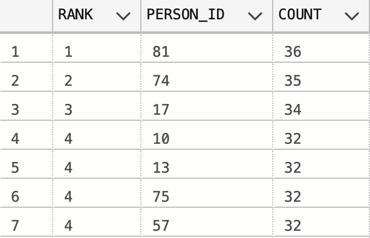 |  | Geslaagd  |

## Ophalen tussenstand competitie

| Stap | Actie                                                      | Input                                                                                           | Expected Output                                                                                             | Output                                                                                                     | Resultaat |
|------|------------------------------------------------------------|-------------------------------------------------------------------------------------------------|-------------------------------------------------------------------------------------------------------------|------------------------------------------------------------------------------------------------------------|-----------|
| 1    | Maak verbinding met de database als data-analist           | ```mongosh 127.0.0.1:27017/flm -u "data-analist" -p "Football@" --authenticationDatabase flm``` |                                         |                                        | Geslaagd  |
| 2    | Voer query uit voor het ophalen van tussenstand competitie | ```db.SCORE_EDITIONS.find()```                                                                  | 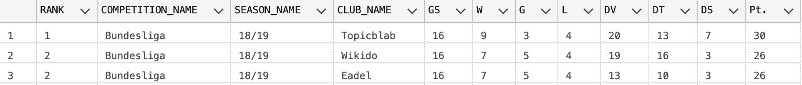 |  | Geslaagd  |

## Ophalen clubinfo

| Stap | Actie                                                          | Input                                                                                           | Expected Output                                                                 | Output                                                                         | Resultaat |
|------|----------------------------------------------------------------|-------------------------------------------------------------------------------------------------|---------------------------------------------------------------------------------|--------------------------------------------------------------------------------|-----------|
| 1    | Maak verbinding met de database als data-analist               | ```mongosh 127.0.0.1:27017/flm -u "data-analist" -p "Football@" --authenticationDatabase flm``` |             |            | Geslaagd  |
| 2    | Voer query uit voor het ophalen van club informatie over Eadel | ```db.CLUB.find({CLUB_NAME:"EADEL"})```                                                         | 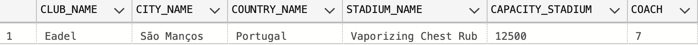 |  | Geslaagd  |

## Ophalen matchinfo

| Stap | Actie                                              | Input                                                                                           | Expected Output                                                                   | Output                                                                           | Resultaat |
|------|----------------------------------------------------|-------------------------------------------------------------------------------------------------|-----------------------------------------------------------------------------------|----------------------------------------------------------------------------------|-----------|
| 1    | Maak verbinding met de database als data-analist   | ```mongosh 127.0.0.1:27017/flm -u "data-analist" -p "Football@" --authenticationDatabase flm``` |               |              | Geslaagd  |
| 2    | Voer query uit voor het ophalen van match met ID 0 | ```db.MATCH.find({MATCH_ID:0})```                                                               | 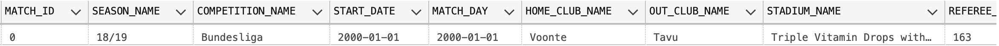 |  | Geslaagd  |

## Ophalen speelronde info

| Stap | Actie                                                                                                         | Input                                                                                           | Expected Output                                                                             | Output                                                                                     | Resultaat |
|------|---------------------------------------------------------------------------------------------------------------|-------------------------------------------------------------------------------------------------|---------------------------------------------------------------------------------------------|--------------------------------------------------------------------------------------------|-----------|
| 1    | Maak verbinding met de database als data-analist                                                              | ```mongosh 127.0.0.1:27017/flm -u "data-analist" -p "Football@" --authenticationDatabase flm``` |                         |                        | Geslaagd  |
| 2    | Voer query uit voor het ophalen van speelronde met startdatum 03-01-2000, seizoen 20/21 en competitie Serie A | ```db.ROUND.find({START_DATE:"2000-01-03", SEASON_NAME:"20/21", COMPETITION_NAME:"Serie A”})``` | 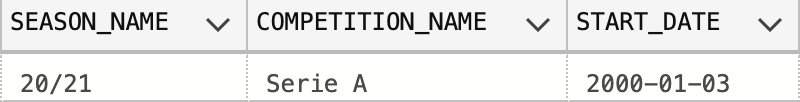 |  | Geslaagd  |

## Ophalen matchday info

| Stap | Actie                                                                                              | Input                                                                                                | Expected Output                                                                         | Output                                                                                 | Resultaat |
|------|----------------------------------------------------------------------------------------------------|------------------------------------------------------------------------------------------------------|-----------------------------------------------------------------------------------------|----------------------------------------------------------------------------------------|-----------|
| 1    | Maak verbinding met de database als data-analist                                                   | ```mongosh 127.0.0.1:27017/flm -u "data-analist" -p "Football@" --authenticationDatabase flm```      |                     |                    | Geslaagd  |
| 2    | Voer query uit voor het ophalen van matchday 01-01-2000 in seizoen 18/19 uit competitie Bundesliga | ```db.MATCHDAY.find({MATCH_DAY:"2000-01-01", COMPETITION_NAME:"Bundesliga", SEASON_NAME:"18/19"})``` |  |  | Geslaagd  |

## Invoeren matchdata

| Stap | Actie                                                                                                  | Input                                                                                                 | Expected Output                                                                      | Output                                                                             | Resultaat |
|------|--------------------------------------------------------------------------------------------------------|-------------------------------------------------------------------------------------------------------|--------------------------------------------------------------------------------------|------------------------------------------------------------------------------------|-----------|
| 1    | Zet de database op                                                                                     | ```docker-compose -f docker-compose.yaml -f docker-compose.dev.yaml up --build --force-recreate -d``` | 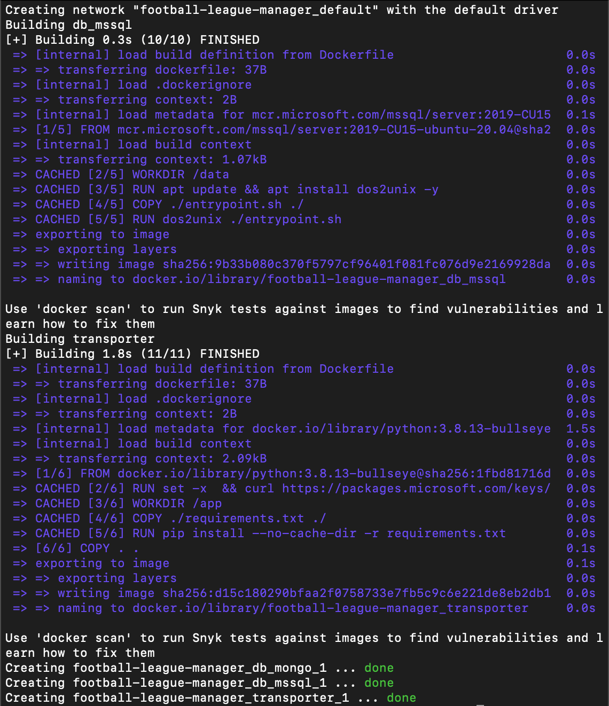          |         | Geslaagd  |
| 2    | Voer query uit voor het invoeren van een rode kaart als matchdata voor person id 11 in de 67ste minuut | ```EXEC PROC_ADD_MATCHDATA_RED_CARD @match_id = 0, @time = 67, @person_id = 11;```                    | Commands completed successfully                                                      | Commands completed successfully                                                    | Geslaagd  |
| 3    | Lees de tabel rode kaart en controleer of het invoeren is gelukt                                       | ```SELECT * FROM RED_CARD WHERE MATCH_ID = 0 AND TIME = 67 AND PERSON_ID = 11```                      | 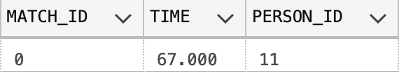 |  | Geslaagd  |

## Updaten clubinfo

| Stap | Actie                                                                        | Input                                                                                                 | Expected Output                                                                  | Output                                                                         | Resultaat |
|------|------------------------------------------------------------------------------|-------------------------------------------------------------------------------------------------------|----------------------------------------------------------------------------------|--------------------------------------------------------------------------------|-----------|
| 1    | Zet de database op                                                           | ```docker-compose -f docker-compose.yaml -f docker-compose.dev.yaml up --build --force-recreate -d``` |       |     | Geslaagd  |
| 2    | Voer query uit voor het updaten van de stadionnaam naar Test voor club Eadel | ```EXEC UPDATE_CLUB @CLUB_NAME = 'Eadel', @STADIUM_NAME = 'Test'```                                   | Commands completed successfully                                                  | Commands completed successfully                                                | Geslaagd  |
| 3    | Lees de tabel club en controleer of het invoeren is gelukt                   | ```SELECT * FROM CLUB WHERE CLUB_NAME = 'Eadel'```                                                    | 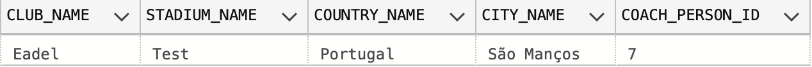 |  | Geslaagd  |

## Start nieuw seizoen competitie

| Stap | Actie                                                                                           | Input                                                                                                                                           | Expected Output                                                                    | Output                                                                           | Resultaat |
|------|-------------------------------------------------------------------------------------------------|-------------------------------------------------------------------------------------------------------------------------------------------------|------------------------------------------------------------------------------------|----------------------------------------------------------------------------------|-----------|
| 1    | Zet de database op                                                                              | ```docker-compose -f docker-compose.yaml -f docker-compose.dev.yaml up --build --force-recreate -d```                                           |         |       | Geslaagd  |
| 2    | Declareer een variabele @teams met type clubNamesTable en vul hem met 4 teams                   | ```DECLARE @teams clubNamesTable; INSERT INTO @teams VALUES ('Eadel'), ('Fadeo'), ('Feedmix'), ('Quimm')```                                     | Commands completed successfully                                                    | Commands completed successfully                                                  | Geslaagd  |
| 3    | Lees @teams uit en controleer of het gevuld is met de gekozen teams                             | ```SELECT * FROM @teams```                                                                                                                      | 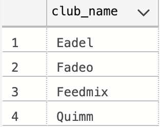             |              | Geslaagd  |
| 4    | Vul season met een nieuwe seasonnaam (22/23), startdatum (2022-06-10) en einddatum (2023-06-10) | ```INSERT INTO SEASON (SEASON_NAME, SEASON_START, SEASON_END) VALUES ('22/23', '2022-06-10', '2023-06-10'```                                    | Commands completed successfully                                                    | Commands completed successfully                                                  | Geslaagd  |
| 5    | Lees de tabel season en controleer of de nieuwe seizoen 22/23 erin staat                        | ```SELECT * FROM SEASON WHERE SEASON_NAME = ('22/23')```                                                                                        | 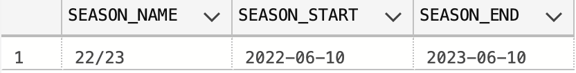           |            | Geslaagd  |
| 6    | Voeg een nieuwe competitie toe met de naam 'TestComp'                                           | ```INSERT INTO COMPETITION (COMPETITION_NAME) VALUES ('TestComp')```                                                                            | Commands completed successfully                                                    | Commands completed successfully                                                  | Geslaagd  |
| 7    | Lees de tabel competitie en controleer of de nieuwe competitie 'TestComp' is toegevoegd         | ```SELECT * FROM COMPETITION WHERE COMPETITION_NAME = 'TestComp'```                                                                             | 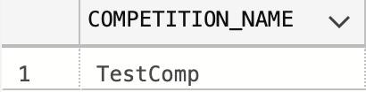 |  | Geslaagd  |
| 8    | Voer query uit voor het starten van een nieuwe seizoen voor competitie 'TestComp'               | ```EXEC START_NEW_EDITION @competitionname = 'TestComp', @seasonname = '22/23', @listofClubs = @teams, @startDateCompetition = '2022-06-10';``` | Commands completed successfully                                                    | Commands completed successfully                                                  | Geslaagd  |
| 9    | Lees de tabel edition en controleer of de nieuwe editie '22/23' erin staat                      | ```SELECT * FROM EDITION WHERE SEASON_NAME = '22/23'```                                                                                         | 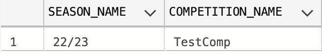         |          | Geslaagd  |
| 10   | Controleer of de matches aangemaakt zijn in de tabel                                            | ```SELECT MATCH_ID, SEASON_NAME, COMPETITION_NAME, FROM MATCH WHERE SEASON_NAME = '22/23'```                                                    | 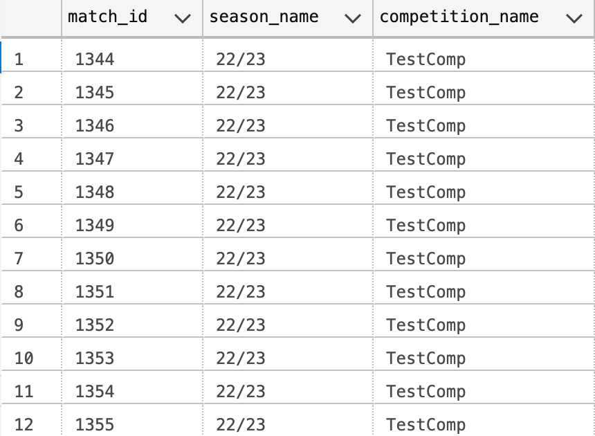         |          | Geslaagd  |

## Toevoegen nieuw persoon

| Stap | Actie                                                                    | Input                                                                                                 | Expected Output                                                                                | Output                                                                                       | Resultaat |
|------|--------------------------------------------------------------------------|-------------------------------------------------------------------------------------------------------|------------------------------------------------------------------------------------------------|----------------------------------------------------------------------------------------------|-----------|
| 1    | Zet de database op                                                       | ```docker-compose -f docker-compose.yaml -f docker-compose.dev.yaml up --build --force-recreate -d``` |                     |                   | Geslaagd  |
| 2    | Voer query uit voor het invoeren van een nieuw persoon met de naam Oktay | ```INSERT INTO PERSON VALUES ('Afghanistan', 'Oktay', 'Yatko', null, '1978-04-10')```                 | Commands completed successfully                                                                | Commands completed successfully                                                              | Geslaagd  |
| 3    | Lees de tabel person en controleer of het invoeren is gelukt             | ```SELECT * FROM PERSON WHERE FIRST_NAME = 'Oktay'```                                                 | 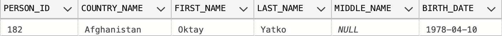 |  | Geslaagd  |

## Toevoegen nieuw event type

| Stap | Actie                                                                      | Input                                                                                                        | Expected Output                                                                                      | Output                                                                                             | Resultaat |
|------|----------------------------------------------------------------------------|--------------------------------------------------------------------------------------------------------------|------------------------------------------------------------------------------------------------------|----------------------------------------------------------------------------------------------------|-----------|
| 1    | Zet de database op                                                         | ```docker-compose -f docker-compose.yaml -f docker-compose.dev.yaml up --build --force-recreate -d```        |                           |                         | Geslaagd  |
| 2    | Voer query uit voor het invoeren van een nieuw event type met de naam Test | ```DECLARE @column ColumnTable; EXEC ADD_NEW_EVENT_TYPE @newEventName = 'Test', @extraColumns = @columns;``` | Commands completed successfully                                                                      | Commands completed successfully                                                                    | Geslaagd  |
| 3    | Lees de tabel test en controleer of het aanmaken is gelukt                 | ```SELECT * FROM Test```                                                                                     | 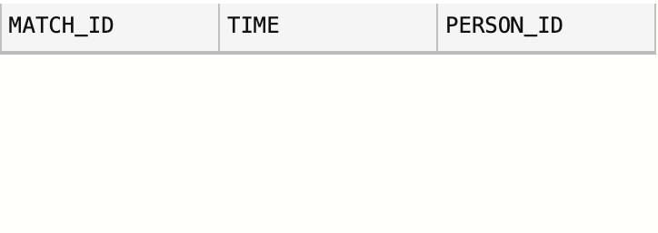 |  | Geslaagd  |

# Insert op basis van feittypen 

| Verwoordingen         | Entiteit    | feittypen                                                                                                                  | SQL INSERT                                                                                                                                                                                                                                                                                                                                   | Status   |
|-----------------------|-------------|----------------------------------------------------------------------------------------------------------------------------|----------------------------------------------------------------------------------------------------------------------------------------------------------------------------------------------------------------------------------------------------------------------------------------------------------------------------------------------|----------|
| Competitie            | COMPETITION | ID: Att Competition_name                                                                                                   | insert into COMPETITION (Competition_name) <br>values ('Bundesliga');                                                                                                                                                                                                                                                                        | Geslaagd |
| Seizoen               | SEASON      | ID: Att Season_name<br><br>Att Season_start                                                                                | insert into <br>SEASON (Season_name, Season_start, Season_end) <br>values ('18/19', '8/1/2018', '5/31/2019');                                                                                                                                                                                                                                | Geslaagd |
| Editie                | EDITION     | ID: ET SEASON + ET COMPETITION<br>MATCH MATCH                                                                              | insert into EDITION (Season_name, Competition_name) <br>values ('18/19', 'Bundesliga');                                                                                                                                                                                                                                                      | Geslaagd |
| Clubs                 | CLUB        | ID: Att Club_name<br><br>ET: EDITION<br>MATCH                                                                              | insert into CLUB (Club_name, Stadium_name, Country_name, City_name, Coach_person_id) <br>values ('Eadel', 'Vaporizing Chest Rub', 'Portugal', 'São Manços', 7);                                                                                                                                                                              | Geslaagd |
| Land                  | COUNTRY     | ID: Att Country_name                                                                                                       | insert into COUNTRY (Country_name) <br>values ('Zimbabwe');                                                                                                                                                                                                                                                                                  | Geslaagd |
| Thuisstad             | CITY        | ID: Att City_name + ET COUNTRY<br>MATCH<br><br>ET CLUB<br>MATCH                                                            | insert into CITY (Country_name, City_name) <br>values ('Zimbabwe', 'Odzi');                                                                                                                                                                                                                                                                  | Geslaagd |
| Stadion               | STADIUM     | ID: Att Stadium_name<br><br>Att capacity                                                                                   | insert into STADIUM (Stadium_name, Capacity) <br>values ('White Alder', 14500);                                                                                                                                                                                                                                                              | Geslaagd |
| Personen              | PERSON      | ID: Att Person_id<br><br>Att First_name                                                                                    | insert into PERSON (Person_id, Country_name, First_name, Last_name, Middle_name, Birth_date) <br>values (81, 'Afghanistan', 'Lynn', 'Stuckow', 'bij', '1/5/1992');                                                                                                                                                                           | Geslaagd |
| Persoon achternaam    | PERSON      | ET: PERSON<br>MATCH<br><br>Att Last_name                                                                                   | insert into PERSON (Person_id, Country_name, First_name, Last_name, Middle_name, Birth_date) <br>values (81, 'Afghanistan', 'Lynn', 'Stuckow', 'bij', '1/5/1992');                                                                                                                                                                           | Geslaagd |
| Persoon tussenvoegsel | PERSON      | ET: PERSON<br>MATCH<br><br>Att Middle_name                                                                                 | insert into PERSON (Person_id, Country_name, First_name, Last_name, Middle_name, Birth_date) <br>values (81, 'Afghanistan', 'Lynn', 'Stuckow', 'bij', '1/5/1992');                                                                                                                                                                           | Geslaagd |
| Geboortedatum         | PERSON      | ET: PERSON<br>MATCH<br><br>Att Birth_date                                                                                  | insert into PERSON (Person_id, Country_name, First_name, Last_name, Middle_name, Birth_date) <br>values (81, 'Afghanistan', 'Lynn', 'Stuckow', 'bij', '1/5/1992');                                                                                                                                                                           | Geslaagd |
| Nationaliteit         | PERSON      | ET: PERSON<br>MATCH<br><br>ET: COUNTRY<br>MATCH                                                                            | insert into PERSON (Person_id, Country_name, First_name, Last_name, Middle_name, Birth_date) <br>values (81, 'Afghanistan', 'Lynn', 'Stuckow', 'bij', '1/5/1992');                                                                                                                                                                           | Geslaagd |
| Coach                 | COACH       | ET: COACH<br>SUBTYPE (PERSON)<br>MATCH<br><br>ET: CLUB<br>MATCH                                                            | insert into CLUB (Club_name, Stadium_name, Country_name, City_name, Coach_person_id) <br>values ('Eadel', 'Vaporizing Chest Rub', 'Portugal', 'São Manços', 7);                                                                                                                                                                              | Geslaagd |
| Spelers rugnummer     | PLAYER      | SUBTYPE (PERSON)<br>MATCH<br><br>Att Jersey                                                                                | insert into PLAYER (Person_id, Club_name, Jersey) <br>values (90, 'Eadel', 13);                                                                                                                                                                                                                                                              | Geslaagd |
| Speler in club        | PLAYER      | ET: PLAYER<br>MATCH<br><br>ET: CLUB<br>MATCH                                                                               | insert into PLAYER (Person_id, Club_name, Jersey) <br>values (90, 'Eadel', 13);                                                                                                                                                                                                                                                              | Geslaagd |
| Speelronde            | ROUND       | ID: ET: EDITION + Att Start_date<br>MATCH                                                                                  | insert into ROUND (Season_name, Competition_name, Start_date) <br>values ('20/21', 'Serie A', '2000-01-19');                                                                                                                                                                                                                                 | Geslaagd |
| Speeldag              | MATCHDAY    | ID: ET: ROUND + Att Match_day<br>MATCH                                                                                     | insert into MATCHDAY (Season_name, Competition_name, Start_date, Match_day) <br>values ('20/21', 'Serie A', '2000-02-04', '2000-06-02');                                                                                                                                                                                                     | Geslaagd |
| Voetbalwedstrijd      | MATCH       | ET MATCHDAY + ET CLUB + ET CLUB<br>MATCH MATCH MATCH                                                                       | insert into MATCH (Match_id, Season_name, Competition_name, Start_date, Match_day, Home_club_name, Out_club_name, <br>Stadium_name, Referee_person_id, Ball_possession_home, Ball_possession_out, Spectators) <br>values (992, '20/21', 'Eredivisie', '2000-01-01', '2000-01-01', 'Topicblab', 'Voonte', 'White Alder', 163, 77, 23, 11718); | Geslaagd |
| Positie               | LINEUP      | ET LINEUP<br>ID: ET MATCH + ET PLAYER<br>MATCH MATCH<br><br>ID: Att: Position_type                                         | insert into LINEUP (Player_person_id, Match_id, Position_type) <br>values (99, 956, 'ATTACKER');                                                                                                                                                                                                                                             | Geslaagd |
| Reserve               | MATCH       | ET: MATCH<br>MATCH<br><br>ET: PLAYER<br>MATCH                                                                              | insert into PLAYER_as_reserve_in_MATCH (Player_person_id, Match_id) <br>values (162,95);                                                                                                                                                                                                                                                     | Geslaagd |
| Balbezit UIT          | MATCH       | ET: MATCH<br>MATCH<br><br>Att Ball_possession_out                                                                          | insert into MATCH (Match_id, Season_name, Competition_name, Start_date, Match_day, Home_club_name, Out_club_name, <br>Stadium_name, Referee_person_id, Ball_possession_home, Ball_possession_out, Spectators) <br>values (992, '20/21', 'Eredivisie', '2000-01-01', '2000-01-01', 'Topicblab', 'Voonte', 'White Alder', 163, 77, 23, 11718); | Geslaagd |
| Balbezit THUIS        | MATCH       | ET: MATCH<br>MATCH<br><br>Att Ball_possession_home                                                                         | insert into MATCH (Match_id, Season_name, Competition_name, Start_date, Match_day, Home_club_name, Out_club_name, <br>Stadium_name, Referee_person_id, Ball_possession_home, Ball_possession_out, Spectators) <br>values (992, '20/21', 'Eredivisie', '2000-01-01', '2000-01-01', 'Topicblab', 'Voonte', 'White Alder', 163, 77, 23, 11718); | Geslaagd |
| Aantal toeschouwers   | MATCH       | ET: MATCH<br>MATCH<br><br>Att Spectator_count                                                                              | insert into MATCH (Match_id, Season_name, Competition_name, Start_date, Match_day, Home_club_name, Out_club_name, <br>Stadium_name, Referee_person_id, Ball_possession_home, Ball_possession_out, Spectators) <br>values (992, '20/21', 'Eredivisie', '2000-01-01', '2000-01-01', 'Topicblab', 'Voonte', 'White Alder', 163, 77, 23, 11718); | Geslaagd |
| Event                 | EVENT       | ID: ET MATCH + ET PLAYER + Att Time<br>MATCH MATCH                                                                         |                                                                                                                                                                                                                                                                                                                                              | Geslaagd |
| Gele kaarten          | YELLOW_CARD | ET: YELLOW_CARD<br>SUBTYPE (EVENT)<br>MATCH<br><br>ET: MATCH<br>MATCH<br><br>ET: PLAYER<br>MATCH                           | insert into YELLOW_CARD (Match_id, [Time], Person_id) <br>values (999, 79.325, 39);                                                                                                                                                                                                                                                          | Geslaagd |
| Rode kaarten          | RED_CARD    | ET: RED_CARD<br>SUBTYPE (EVENT)<br>MATCH<br><br>ET: MATCH<br>MATCH<br><br>ET: PLAYER<br>MATCH                              | insert into RED_CARD (Match_id, [Time], Person_id) <br>values (999, 8.98, 39);                                                                                                                                                                                                                                                               | Geslaagd |
| Wissels               | SUBSTITUTE  | ET: SUBSTITUTE<br>SUBTYPE (EVENT)<br>MATCH<br><br>ET: MATCH<br>MATCH<br><br>ET: PLAYER<br>MATCH<br><br>ET: PLAYER<br>MATCH | insert into SUBSTITUTE (Match_id, [Time], In_person_id, Out_person_id, Position_type) <br>values (998, 62.309, 138, 103, 'KEEPER');                                                                                                                                                                                                          | Geslaagd |
| Overtredingen         | FOUL        | ET: FOUL<br>SUBTYPE (EVENT)<br>MATCH<br><br>ET: MATCH<br>MATCH<br><br>ET: PLAYER<br>MATCH                                  | insert into FOUL (Match_id, [Time], Person_id) <br>values (510, 48.55, 74);                                                                                                                                                                                                                                                                  | Geslaagd |
| Hoekschoppen          | CORNER      | ET: CORNER<br>SUBTYPE (EVENT)<br>MATCH<br><br>ET: MATCH<br>MATCH<br><br>ET: PLAYER<br>MATCH                                | insert into CORNER (Match_id, [Time], Person_id) <br>values (1003, 4.493, 69);                                                                                                                                                                                                                                                               | Geslaagd |
| Schoten               | SHOT        | ET: SHOT<br>SUBTYPE (EVENT)<br>MATCH<br><br>ET: MATCH<br>MATCH<br><br>ET: PLAYER<br>MATCH<br><br>Att On_goal               | insert into GOAL (Match_id, [Time], Person_id) <br>values (961, 60.949, 32);                                                                                                                                                                                                                                                                 | Geslaagd |
| Passes                | PASS        | ET: PASS<br>SUBTYPE (EVENT)<br>MATCH<br><br>ET: MATCH<br>MATCH<br><br>ET: PLAYER<br>MATCH<br><br>Att Succes                | insert into PASS (Match_id, [Time], Person_id, Succes) <br>values (326, 20.727, 12, 0);                                                                                                                                                                                                                                                      |  Geslaagd  |
| Scheidsrechter`       | REFEREE     | ET: REFEREE<br>SUBTYPE (PERSON)<br>MATCH<br><br>ET: MATCH<br>MATCH                                                         | insert into REFEREE (Person_id) <br>values (180);                                                                                                                                                                                                                                                                                            |  Geslaagd  |


# Conclusie

Op basis van de bovenstaande testresultaten is de conclusie dat de huidige database genoeg code coverage (80%+) dekt voor een succesvolle uitrol naar productie. Alle code is getest op minimaal één success scenario en minimaal één edge-case. Er wordt gecontroleerd of de afgesproken exceptions gegooid worden wanneer ze moeten, daarbij ook dat ze niet een exception throwen wanneer dat niet moet.
